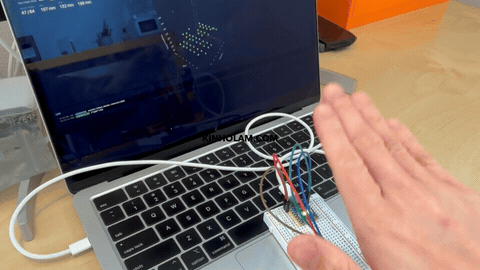
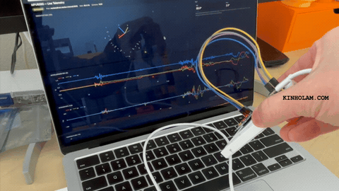
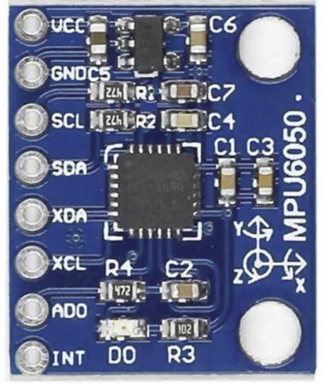

# MicroPython Boardfarm

[> Quickstart 🏇🏼](#quickstart)

An experiment on embedded IoT hardware and software.
AI co-develops the software from human direction and diagnosis of the embedded system. 
Write-once library code runs across different MCUs and shared peripherals. 🦾🧠

<table>
<tr>
<td align="center">
 
<a href="https://youtu.be/u9xHM_khi90">https://youtu.be/u9xHM_khi90</a>
</td>
<td align="center">
 
<a href="https://youtu.be/xvH-vMaSqCY">https://youtu.be/xvH-vMaSqCY</a>
</td>
</tr>
</table>

|   | MCU | Notes |
|:---:|---|---|
|  | RP2040-Zero | No wireless. Onboard WS2812 RGB LED. 264 KB SRAM, no threads. |
|  | RP2350 (Pico 2 W) | WiFi + Bluetooth via the onboard CYW43. Status LED on/off only. |
|  | ESP32-S3-Zero | WiFi + BLE. Onboard WS2812 RGB LED. Native USB-CDC; must be in bootloader mode (BOOT+RESET) before flashing. |

|   | Peripheral | Notes |
|:---:|---|---|
|  | [MPU6050](firmware-packages/mpu6050/) | 6-axis IMU (accel + gyro + temp) |
|  | [VL53L0X](firmware-packages/vl53l0x/) | Time-of-flight range |
|   | [VL53L5CX](firmware-packages/vl53l5cx/) | Time-of-flight range (8×8 multizone) |
|   | VL53L8CX | Time-of-flight range |
|   | PN532 | NFC |
|   | ATGM336H | GPS |
|   | QMC5883P | Magnetometer |
|   | I²C displays | Display |

# Quickstart

- [cpython-packages/ 💻](cpython-packages/) contains shared CPython code. These libraries run on an computer, not on the MCU.
- [firmware-packages/ 🕹️](firmware-packages/) contains shared MicroPython code; the microcontroller's I²C bus, status LED, sensor drivers etc. Stubs enable tests to run with CPython for regression tests.
- [projects/ 🚂](projects/) contains runnable example projects that use above packages to make firmware and interfaces.

**Makefile**
- Quality-gate helpers; see [CI.md](CI.md) for the full CI and pre-commit details.

| Command | Notes |
|---|---|
| `make init` | Install the git pre-commit hook (points `core.hooksPath` at `.githooks/`). Run once after cloning. 🧰 |
| `make precommit` | Run the local gate on staged Python: auto-fix with `ruff`, then verify `ruff` + `pydoclint` + `ty`. Runs automatically on commit. 🔧 |
| `make remove-ci` | DELETE the CI / pre-commit / linting files (keeps the build/test guard script). 🚀 |

**Requirements**
- [Docker](https://docs.docker.com/engine/install/) — every toolchain, flasher, serial reader, and test runs inside a container
   - Flashing a board: [projects/microcontrollers.md](projects/microcontrollers.md)
   - Mac Users: see [serial bridge setup](tools/serial-bridge/serial-bridge.md#macos-serial-bridge).

**Docker commands**

The following commands can be run from the project root directory. [projects/ 🚂](projects/) may have their own commands.
| Command | Notes |
|---|---|
| `docker compose up pytest --build --exit-code-from pytest` | Run all tests 🤞🙏 |
| `docker compose run --rm pytest <path>` | Run a targeted subset, e.g. `/projects/distance-stream/tests` or `/firmware-packages/vl53l0x/tests -k status` 🐒 |
| `docker compose run --rm --build uv lock` | Refresh `uv.lock` from `pyproject.toml` 🤳🏻 |
| `docker compose run --rm uv lock --upgrade` | Bump pinned versions 🫡 |

# Versioning

Each versioned scope — the repo root plus every `firmware-packages/*`,
`cpython-packages/*`, and `projects/*` that carries a `pyproject.toml` — is versioned
independently under [semantic versioning](https://semver.org). Any change to code or
config inside a scope must raise that scope's `version`:

| Bump | When |
|---|---|
| **PATCH** | Bug fixes and internal changes with no API or behaviour change. |
| **MINOR** | Backward-compatible additions — new public API, or a new project feature. |
| **MAJOR** | Breaking changes — incompatible API, runtime behaviour, or JSON output schema. |

The new version must be **strictly greater** than the one on `main`; CI
([.githooks/check_version_bumps.sh](.githooks/check_version_bumps.sh) — the
**version-check** guard described in [CI.md](CI.md)) rejects a commit that leaves a
dirtied scope's version unchanged or lower.

Workspace-level edits bump the **root** `pyproject.toml` rather than any nested package
or project: the `uv.lock` lockfile, top-level `docs/` / `scripts/` / `tools/`, and a
package's or project's own `tests/`. Build artifacts under `outputs/` (the `*.uf2` /
`*.bin` images) never require a bump.

