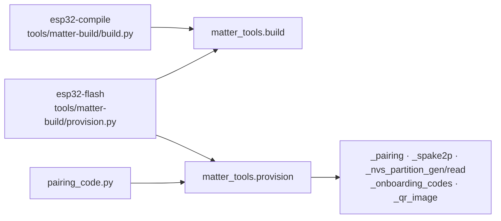

# matter_tools

Host code that compiles Matter firmware and gives one board its pairing
credentials. It runs in ESP-IDF's Python inside the `Dockerfile.matter` stages
and never reaches the device. The scripts those stages run live in
[`tools/matter-build/`](../../tools/matter-build/); they own the command line
and the container paths and call this package for everything else.



## Modules

| Module | What it does |
| --- | --- |
| `build` | Reads the board's identity from `sdkconfig.board` and `partitions.csv`, compiles MicroPython with the native bridge, merges the image, and publishes artifacts to the output directory. |
| `provision` | Derives pairing codes from a key, mints the factory partition and QR, checks them against each other, writes the partition into the compiled image, and builds the esptool flash command. |

Modules whose names start with `_` are private helpers for `provision`.

## Pairing

`provision.generate_pairing(passcode)` derives pairing codes from one secret key
alone, so a key gives the same codes on every board. It returns the resolved
`key`, `passcode` (the derived Matter setup passcode), `discriminator`, and
`manual_pairing_code`. A key shorter than 24 characters or spanning fewer than
12 distinct ones raises `ValueError`. Omitting it draws a random 256-bit key as
64 hexadecimal characters, returned as `key` so the codes stay reproducible. To
base a key on a board MAC, a serial number, or a vault, build that string before
calling.

The algorithm hashes `passcode.encode()` with SHA-256.
The first four digest bytes, read big-endian, map to `1..99999999`; forbidden
Matter passcodes advance to the next allowed value, wrapping to 1. The low 12
bits of the next two bytes form the discriminator.

To flash with a chosen key instead of a random one, set `PASSCODE`:

```console
PASSCODE=<key> docker compose run --rm --build esp32-flash
```

Either way the key lands as `passcode` in `outputs/app.esp32-s3.setup.txt`. Keep
the key and that file secret: the key alone gives away the pairing code of every
board flashed with it.

From either Matter project directory you can regenerate a board's QR and manual
code from its key without hardware, using that project's board configuration for
the QR vendor and product IDs:

```console
docker compose run --rm --no-deps --entrypoint bash esp32-flash -c \
  '. /opt/esp/idf/export.sh >/dev/null; python3 /matter-tools/pairing_code.py --passcode <key> --output /outputs/app.esp32-s3.qr.png'
```

## Install

`Dockerfile.matter` installs the wheel from the `wheels` stage into ESP-IDF's
Python with `--no-deps`; the same file pins the third-party dependencies. Edits
reach the stages on the next `--build`.

## Tests

From the repo root:

```console
docker compose up pytest --build --exit-code-from pytest -- /cpython-packages/matter_tools/tests
```

The callers' own tests live in `tools/matter-build/tests/`.
