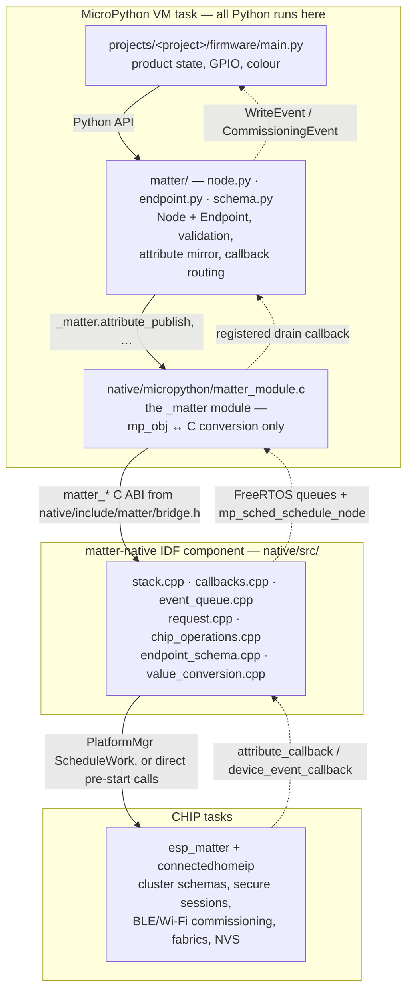
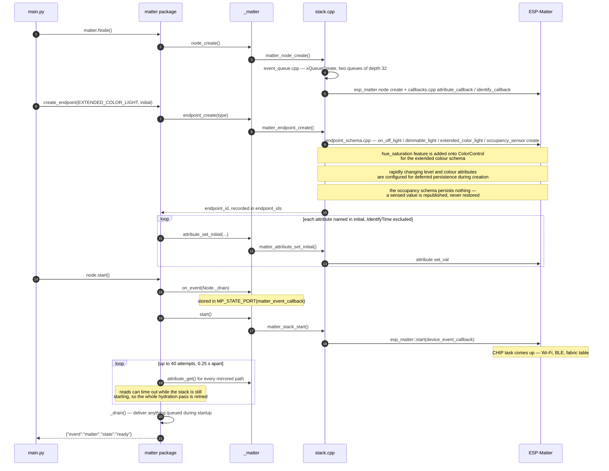
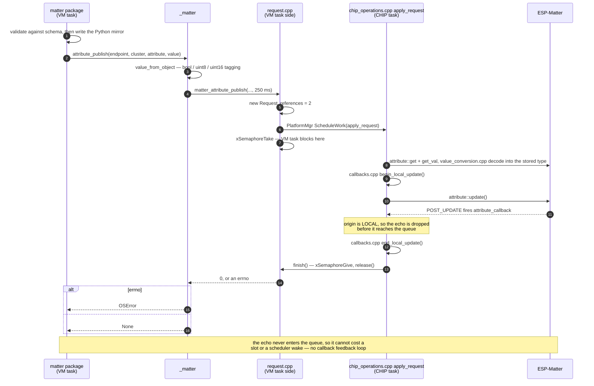
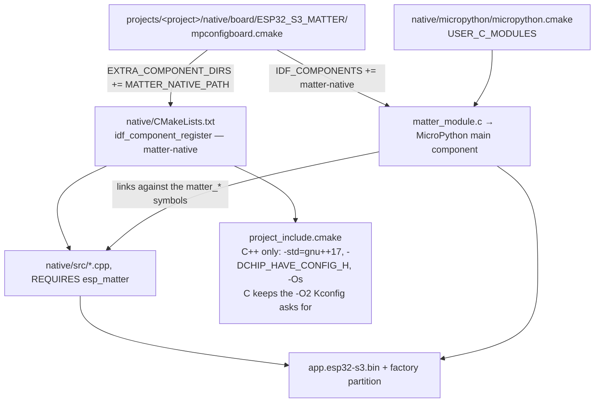

# How the native halves fit together

Four layers separate a project's `endpoint.on = True` from a CHIP attribute
write, and two FreeRTOS tasks own them between the two. Everything below is what
the code in [`native/`](native/) and [`matter/`](matter/) actually does.

## The layers



Solid edges are calls down from Python; dashed edges are events coming back up.
`bridge.h` is the only thing the two C halves share — it is plain C with
`extern "C"`, so `matter_module.c` never sees a CHIP or C++ type, and the C++
sources never see an `mp_obj_t`.

## Where the code lives

The component splits along the seams the sections below trace: who owns a piece
of state, and which task is allowed to touch it.

| Source | Owns |
| --- | --- |
| `src/stack.cpp` | the one node, the endpoint registry, the `started` barrier, and the pre-start C API |
| `src/endpoint_schema.cpp` | the on/off, dimmable, extended-colour and occupancy-sensor endpoint configs handed to ESP-Matter |
| `src/event_queue.cpp` | separate 32-deep attribute and commissioning queues, their shared ordering sequence, the attribute overflow generation, and their drain C API |
| `src/callbacks.cpp` | everything ESP-Matter and CHIP call into, and the window in which a local echo is suppressed |
| `src/request.cpp` | Request allocation, refcounting, scheduling, and the bounded-request C API |
| `src/chip_operations.cpp` | the operation bodies that run on the CHIP task — nothing here may block |
| `src/value_conversion.cpp` | `esp_matter_attr_val_t` ↔ the flat `(uint32_t, type tag)` pair, in both directions |

Each source has a header beside it declaring only what other sources need, and
those live behind `PRIV_INCLUDE_DIRS` — `include/matter/bridge.h` stays the
component's only public header. Everything internal sits in namespace
`matter_bridge`; the `extern "C"` entry points sit outside it, in the file that
owns the state each one guards.

## Three ways a Python call reaches native code

| Class | Entry points | Task it executes on | Blocking |
| --- | --- | --- | --- |
| Pre-start setup | `node_create`, `endpoint_create`, `attribute_set_initial`, `start` | VM task, directly against `esp_matter` before the stack runs | none |
| Bounded request | `attribute_get`, `attribute_publish`, `open_commissioning_window`, `fabrics`, `remove_fabric`, `factory_reset` | body runs on the CHIP task via `ScheduleWork`; VM task waits on a semaphore | ≤ 250 ms (`MATTER_REQUEST_TIMEOUT_MS`) |
| Queue drain | `next_event`, `overflow_generation` | VM task, non-blocking `xQueuePeek` / `xQueueReceive` | none |

Setup calls are guarded by the `started` flag in `stack.cpp`, so they can only
touch `esp_matter` structures while nothing else is running against them.
Node creation owns both queues: if ESP-Matter cannot create the node after they
are allocated, the failure path deletes them before returning so a retry cannot
leak or inherit stale events.

## Boot



## A local change going out

`endpoint.on = True` in project code ends up on the CHIP task and comes back as
a suppressed echo:



`release()` is refcounted at 2 because a request that times out on the VM task
may still be executing on the CHIP task. Whichever side finishes last frees the
allocation. A `Request` is deliberately small — its completion semaphore is
inline (`StaticSemaphore_t`, so it costs no second allocation) and the fabric
table hangs off a pointer only the fabric query allocates, because publishing an
attribute is the one thing on this path that happens often.

## A controller write coming in

Nothing here calls Python. The CHIP task only enqueues and pokes the MicroPython
scheduler; Python resumes on the VM task whenever the scheduler next runs.

```mermaid
sequenceDiagram
    autonumber
    participant ctl as Matter controller
    participant esp as ESP-Matter<br/>(CHIP task)
    participant st as callbacks.cpp<br/>+ event_queue.cpp
    participant mod as matter_module.c
    participant py as matter package<br/>(VM task)
    participant app as main.py

    ctl->>esp: write OnOff / CurrentHue / …
    esp->>st: attribute_callback(POST_UPDATE, endpoint, cluster, attribute, value)
    st->>st: endpoint_exists + encode_value — unknown endpoints and unsupported<br/>value types are dropped; an unmirrored (cluster, attribute)<br/>path is dropped later, in Python's _accept_remote
    st->>st: publish_attribute_event() → attribute xQueueSend
    alt attribute queue full
        st->>st: discard oldest, send, increment overflow_generation
    end
    st->>mod: matter_bridge_notify_event()
    mod->>mod: mp_sched_schedule_node(matter_event_node, dispatch_event)
    Note over mod: repeat notifies collapse into one pending node,<br/>which is why the drain is a loop

    mod->>py: dispatch_event calls the registered callback under nlr_push
    loop until next_event() returns None
        py->>mod: next_event()
        mod->>st: matter_next_event() → peek both queue heads,<br/>receive the lower shared sequence; no wait
        st-->>py: (kind, endpoint_id, cluster, attribute, value, origin)
        py->>py: _handle — remote attribute events only
        py->>py: _accept_remote — validate, update mirror
        py->>app: on_write(WriteEvent)
        app->>app: render the pixel
    end
    py->>mod: overflow_generation()
    alt generation differs from the last successful pass
        py->>py: _resynchronize — retry attribute_get for every path,<br/>replay whatever differs
        py->>py: record the generation only after every read succeeds
    end
```

Commissioning events enter their own 32-deep queue from
`device_event_callback`, arriving as `MATTER_EVENT_COMMISSIONING` and decoding
to a `CommissioningEvent` in `_COMMISSIONING_STATES`. A shared uint32 sequence
on the two queues' internal envelopes preserves arrival order without allowing
an attribute burst to evict a lifecycle transition. The commissioning queue
itself stays bounded and drop-oldest if more than 32 of its own transitions
remain undrained. When the last fabric is removed, `callbacks.cpp` reopens a
basic commissioning window itself so the device stays pairable.

A callback exception is contained on both sides — `dispatch_event` catches it
with `nlr_push` and prints a JSON error, and Python catches subscriber
exceptions per event — so one bad callback never stops delivery.

## How the two C halves get built

They compile into different components on purpose:



`matter_module.c` has to live in MicroPython's own main component so the QSTR and
`MP_REGISTER_MODULE` scanners see it, which is why it is absent from
`native/CMakeLists.txt`. Adding `matter-native` to `IDF_COMPONENTS` puts it on
that main component's `REQUIRES`, which is what lets the frozen-in module reach
the bridge symbols without patching upstream MicroPython. The Python half is
frozen separately by `manifest.py`.

## Invariants worth keeping

- Python never runs on a CHIP task or in an interrupt. The only upward path is
  the bounded queues plus `mp_sched_schedule_node`.
- Every Python-originated mutation is scheduled onto the CHIP event loop and
  bounded at 250 ms, so a stalled stack surfaces as `ETIMEDOUT`, not a hang.
- The attribute queue is lossy by design: 32 deep and drop-oldest, with a
  non-consuming overflow generation that makes Python re-read state rather than
  trust a gap. Commissioning has a separate 32-deep queue, and a shared sequence
  preserves ordering between the two.
- No product behaviour lives below `main.py` — the `native/src` sources and
  `matter_module.c` know nothing about pixels, pins, or colour.
