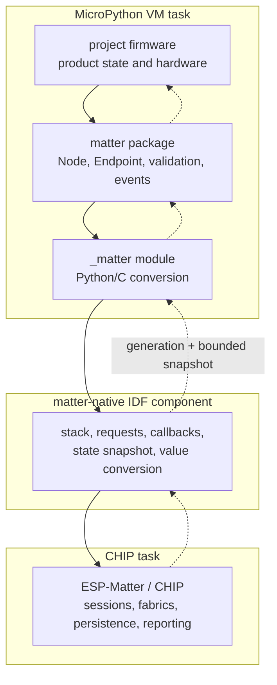
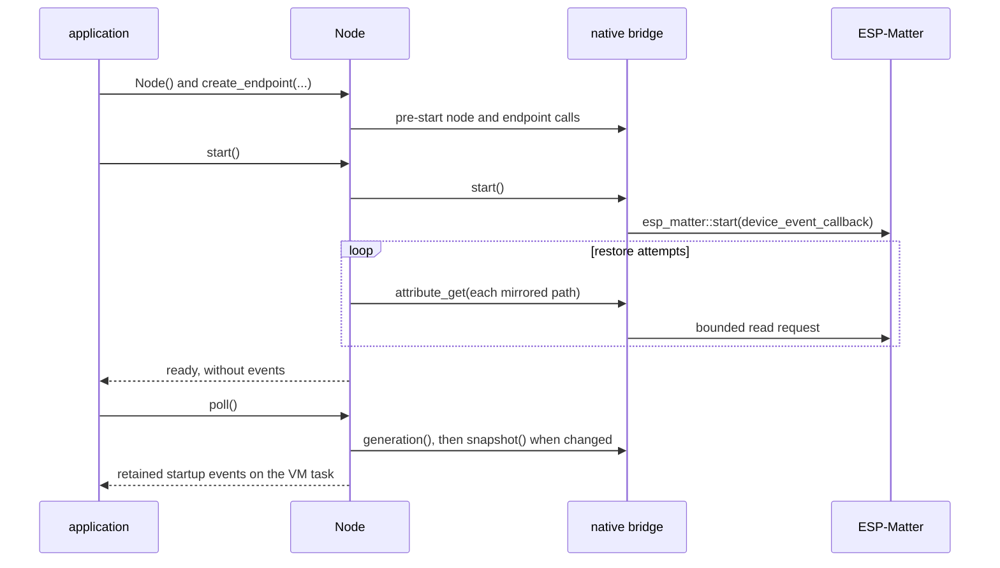
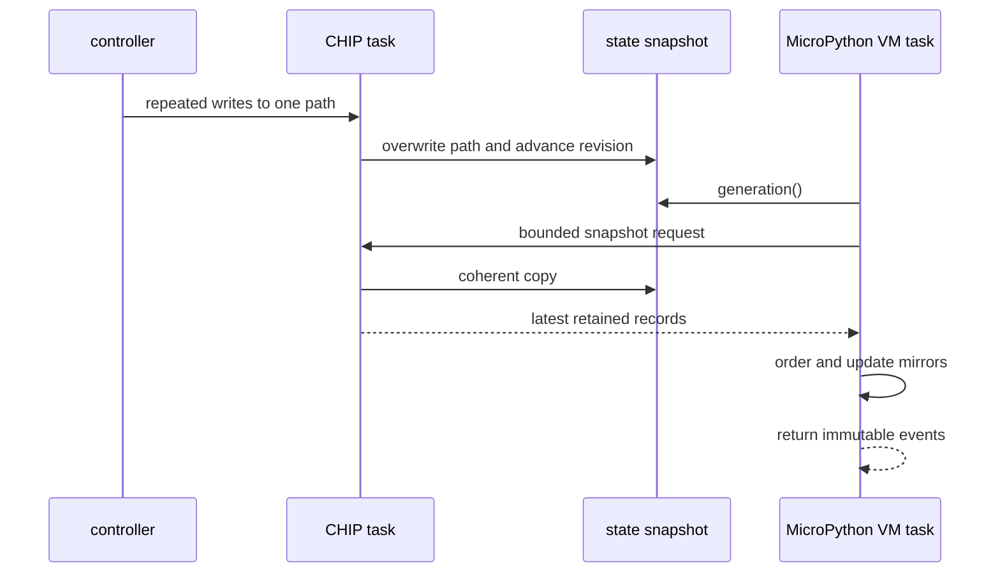

# Matter bridge architecture

The Matter bridge keeps protocol ownership in ESP-Matter while applications
retain product policy and hardware ownership in MicroPython. Python never runs
on a CHIP task or interrupt; applications pull retained native state by calling
`Node.poll()` on the VM task.

## Layers and task boundary



`native/include/matter/bridge.h` is the plain-C boundary between
`matter_module.c` and the C++ component. The module sees no CHIP types, and the
C++ component sees no `mp_obj_t`.

| Source | Responsibility |
| --- | --- |
| `stack.cpp` | Node lifecycle, endpoint IDs/types, startup barrier, and mirrored-path lookup |
| `endpoint_schema.cpp` | Supported endpoint construction and mirrored attribute vocabulary |
| `callbacks.cpp` | Controller-write capture, commissioning recovery, and local-origin suppression |
| `state_snapshot.cpp` | Fixed coalesced records and the shared wrapping revision |
| `request.cpp` | Refcounted cross-task requests, timeout safety, and C entry points |
| `chip_operations.cpp` | Non-blocking operation bodies that execute on the CHIP task |
| `value_conversion.cpp` | ESP-Matter values to and from tagged bridge scalars |

## Native calls

| Class | Entry points | Execution |
| --- | --- | --- |
| Pre-start | `node_create`, `endpoint_create`, `attribute_set_initial`, `start` | Directly on the VM task before CHIP owns live state |
| Bounded request | Attribute read/publish, `snapshot`, commissioning/fabric administration | Scheduled onto CHIP; VM waits at most 250 ms |
| Atomic observation | `generation` | Direct atomic read from the VM task |
| Platform read | `network_address` | ESP-IDF marshals onto lwIP internally |

Requests start with two references because a VM timeout does not cancel work
already accepted by CHIP. Snapshot results therefore live in request-owned
bounded storage until CHIP releases its reference; timed-out callers never
leave CHIP writing into expired VM memory.

## Startup and restoration



Restoration is deliberately older than cooperative delivery. A controller
write observed during startup can already be visible to an attribute read, but
its retained revision still produces one event on the first poll.

## Coalesced controller state

`state_snapshot.cpp` owns 160 static attribute slots: sixteen endpoints times
the largest ten-path Python schema. Only paths mirrored by the endpoint's
Python schema enter the table. Repeated writes overwrite the same slot.
Commissioning has separate session and window slots, so a reopened window does
not displace the outcome of the latest session.

Every retained update receives one node-wide `uint32` revision. `generation()`
returns that revision atomically. When it differs from Python's committed
generation, `snapshot()` runs on the CHIP task and returns one coherent copy:

```text
(captured_generation,
 ((revision, kind, endpoint_id, cluster, attribute, value), ...))
```

`Node.poll()` discards records that are not newer than its committed generation,
orders the rest by wrapping revision distance, updates every endpoint mirror,
and returns immutable events to the application. It commits
`captured_generation` only after the whole batch succeeds, so a failed request
remains retryable. Fewer than half the revision space may elapse between
successful polls.



There are no custom FreeRTOS event queues and no MicroPython scheduler
notification. Poll cadence and error recovery belong to each application.

## Local publication

`Endpoint.set()` validates a complete named batch, updates the Python mirror
synchronously, then schedules one bounded native request. The native origin
guard suppresses ESP-Matter echoes across the batch. Each successful update
clears any older retained remote record for that path; a later poll cannot
replay stale controller state over the newer Python decision.

Occupancy uses the code-driven `OccupancySensingCluster` getter and setter
because its controller-visible value does not live in ESP-Matter's generic
attribute store. Local occupancy publication uses the same snapshot invalidation
rule even though its setter does not produce a generic attribute callback.

## Commissioning

Device callbacks retain the latest session state (`STARTED`, `COMPLETE`, or
`FAILED`) and window state (`OPENED` or `CLOSED`). The shared revision preserves
their cross-lifecycle order when both survive coalescing. Immediate recovery
stays native: an unpaired node reopens a commissioning window after CHIP stops
listening, an inactive window closes, or the final fabric is removed.

Commissioning events are returned from `Node.poll()` alongside controller
writes and are also emitted as compact JSON for diagnostics.

## Build split and invariants

`matter_module.c` compiles into MicroPython's main component so QSTR and module
registration scanners see it. The C++ sources compile as the `matter-native`
IDF component and are linked through the board's Matter configuration. The
Python package is frozen separately by `manifest.py`.

- Python executes only on the VM task and only when application code calls it.
- CHIP callbacks never block, allocate snapshot records, or touch product hardware.
- The snapshot retains state, not transition history; intermediate writes may coalesce.
- Local publications remain synchronous and never produce remote write events.
- Commissioning recovery remains immediate and native.
- Product state, timing, pixels, pins, and hardware lifecycle remain in projects.
