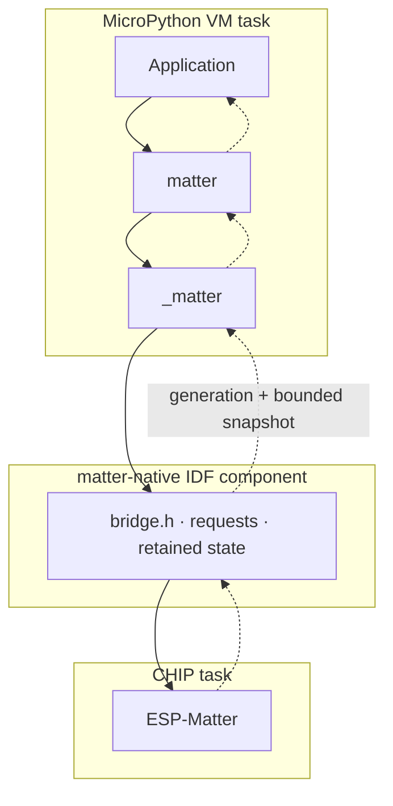
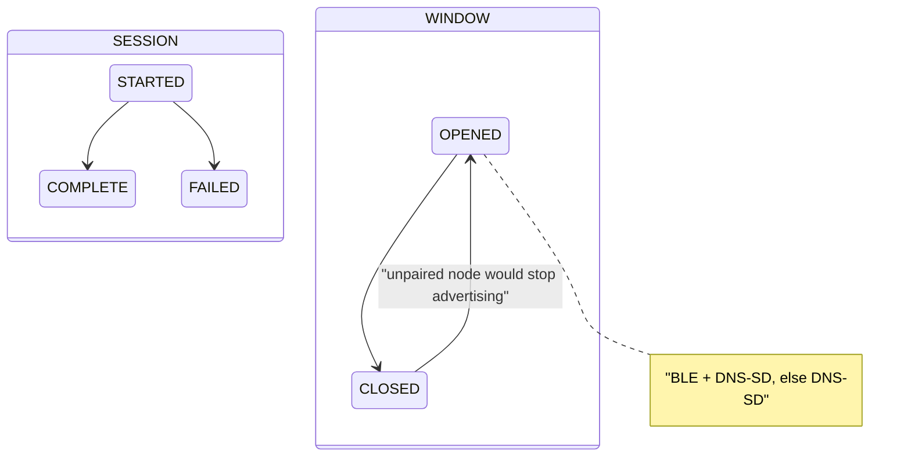

# matter

`matter` exposes [ESP-Matter](https://github.com/espressif/esp-matter) to
MicroPython applications that own endpoint state, hardware, and product policy.
ESP-Matter owns secure sessions, commissioning, fabrics, persistence, protocol
reads, and subscriptions. Applications
[publish local decisions synchronously](native/src/request.cpp#L139-L156)
and [pull controller changes cooperatively](matter/node.py#L132-L162), keeping
hardware actions on the VM task while protocol callbacks retain bounded native
state. The package claims no GPIO and imports no board, pixel, timer, or async
runtime; it is neither a hardware driver nor a second Matter implementation.

## Architecture

No callback ever enters Python; application code crosses tasks through a
plain-C boundary.



The module sees no CHIP types; C++ sees no `mp_obj_t`.

## Pairing

`matter.generate_pairing(passcode)` derives pairing codes from one secret key
alone, so a key gives the same codes on every board. It returns the resolved
`key`, `passcode` (the derived Matter setup passcode), `discriminator`, and
`manual_pairing_code`. A key shorter than 24 characters or spanning fewer than
12 distinct ones raises `ValueError`. Omitting it draws a random 256-bit key as
64 hexadecimal characters, returned as `key` so the codes stay reproducible. To
base a key on a board MAC, a serial number, or a vault, build that string before
calling.

The algorithm hashes `b"matter-pairing-v2\x00" + passcode.encode()` with SHA-256.
The first four digest bytes, read big-endian, map to `1..99999999`; forbidden
Matter passcodes advance to the next allowed value, wrapping to 1. The low 12
bits of the next two bytes form the discriminator.

To flash with a chosen key instead of a random one, set `PASSCODE`:

```console
PASSCODE=<key> docker compose run --rm --build esp32-flash
```

Either way the key lands as `passcode` in `outputs/app.esp32-s3.setup.txt`. Keep
the key and that file secret: the key alone gives away the pairing code of every
board flashed with it.

The build tools import this same module, so from either Matter project directory
you can regenerate a board's QR and manual code from its key without hardware,
using that project's board configuration for the QR vendor and product IDs:

```console
docker compose run --rm --no-deps --entrypoint bash esp32-flash -c \
  '. /opt/esp/idf/export.sh >/dev/null; python3 /matter-tools/pairing_code.py --passcode <key> --output /outputs/app.esp32-s3.qr.png'
```

## Components

| Unit | Responsibility |
| --- | --- |
| `Node` | Owns endpoint lifecycle, restored mirrors, events, and fabrics. |
| `Endpoint` | Validates complete decisions and exposes read-only properties. |
| `_matter` | Converts Python values across 13 plain-C primitives. |
| Native requests | Schedule CHIP operations with timeout-safe owned storage. |
| Retained state | Coalesces attributes and separate session/window state. |
| ESP-Matter | Owns protocol state, persistence, commissioning, and reporting. |

`matter_module.c` builds in MicroPython's main component for QSTR scanning;
C++ builds as `matter-native`; `manifest.py` freezes Python separately.

## Key flows

**Publication** validates the whole `set()` batch before changing mirrors and
submits one bounded request; `OSError` retains Python values for retry.
Earlier native updates may already have succeeded: publication is not atomic.


**Polling** checks atomic `generation()` before requesting a coherent snapshot.
It updates every mirror and returns an immutable ordered tuple of `WriteEvent`
and `CommissioningEvent`, running no application code. Repeated writes coalesce;
a failed poll stays retryable because generation commits only after processing.
Successful local publication clears older retained remote state without echoes.
`WriteEvent(endpoint, cluster, attribute, value)` identifies each changed path;
shared wrapping revisions order attributes and commissioning together.

**Commissioning** transitions arrive as `CommissioningEvent(name, state)` and as
structured JSON; names are `Commissioning.SESSION`/`Commissioning.WINDOW`.
`FAILED` describes one attempt, not the end of pairing.



## Contracts and limits

Create endpoints before `start()`: `ON_OFF_LIGHT`, `DIMMABLE_LIGHT`,
`EXTENDED_COLOR_LIGHT`, and `OCCUPANCY_SENSOR`; multiple instances may coexist.
`initial={(cluster, attribute): value}` pins named persistent values every boot;
omit controller-owned values. Startup restores mirrors without events; explicit
polling delivers retained startup events.

Occupancy declares PIR and uses bitmap integers `0`/`1`; it is not persisted,
cannot use `initial`, and must be published after `start()` on every reboot.
Its native getter/setter uses the code-driven occupancy cluster, bypassing the
generic attribute store while preserving snapshot invalidation.
`ColorMode` constants are `HUE_SATURATION`, `XY`, `COLOR_TEMPERATURE`, and
`ENHANCED_HUE_SATURATION`.

Pre-start calls execute directly; live mutations/reads/snapshots use ≤250 ms
requests. Timeouts do not cancel CHIP work.
`network_address()` delegates its platform read to ESP-IDF/lwIP.

Limits are 16 endpoints, 10 attributes/batch, 160 attribute slots plus
2 commissioning slots, and 16 fabrics. Fewer than half the wrapping
`uint32` revision space may pass between successful polls. Callbacks never
block, allocate snapshot records, or touch hardware; recovery stays native.

## Use

Consume events after `poll()` returns; hardware functions belong to the project.

```python
import time

import matter

node = matter.Node()
light = node.create_endpoint(matter.EndpointType.ON_OFF_LIGHT)
node.start()
update_hardware(light.on)
while True:
    for event in node.poll():
        if isinstance(event, matter.WriteEvent) and event.endpoint is light:
            update_hardware(light.on)
    time.sleep_ms(50)
```

Administration uses `open_commissioning_window()`, `fabrics()`,
`remove_fabric()`, and `factory_reset()`; fabric records contain only non-secret
metadata.
The host [micropython_stubs](../../cpython-packages/micropython_stubs/) fake
exercises the same primitive boundary.

See the [radar project](../../projects/matter-radar-sensor/README.md) for a full
integration.
