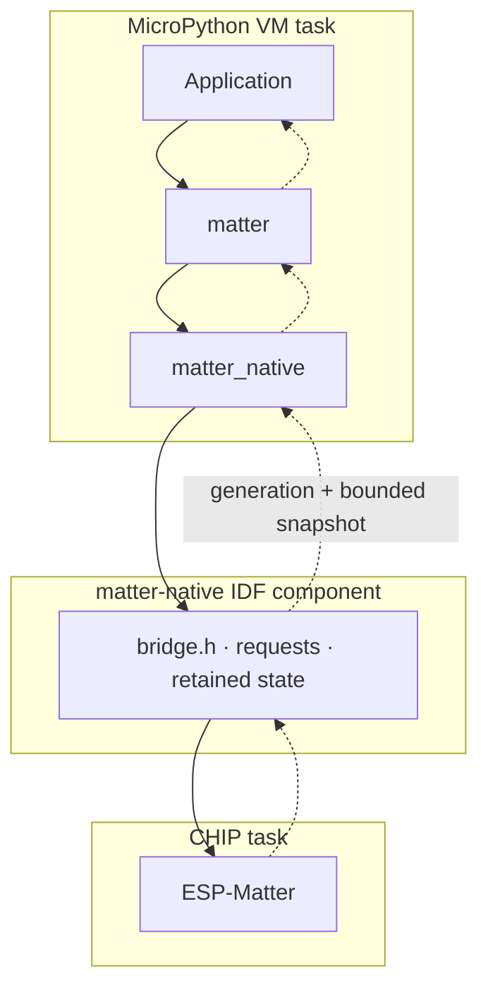
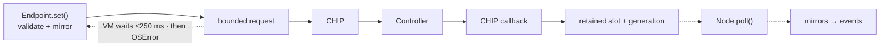
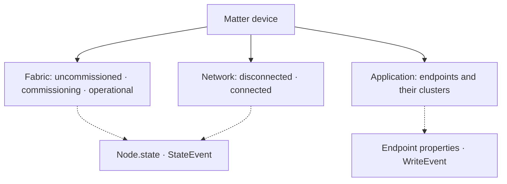
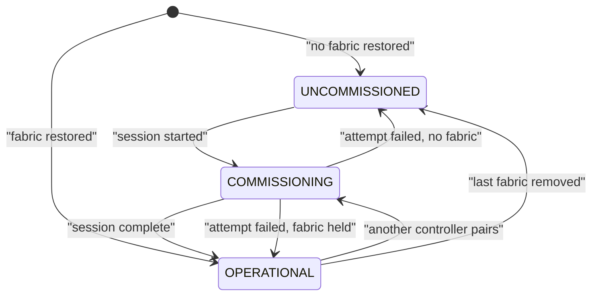
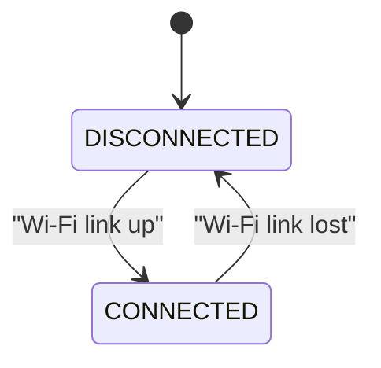

# matter

`matter` exposes [ESP-Matter](https://github.com/espressif/esp-matter) to
MicroPython applications that own endpoint state, hardware, and product policy.
ESP-Matter owns secure sessions, commissioning, fabrics, persistence, protocol
reads, and subscriptions. Applications publish local decisions synchronously
(`Endpoint.set()`, which lands in `matter_attributes_publish` in
[request.cpp](native/src/request.cpp)) and pull controller changes
cooperatively (`Node.poll()` in [node.py](matter/node.py)), keeping hardware
actions on the VM task while protocol callbacks retain bounded native state.
The package claims no GPIO, and `import matter` loads no board, pixel, timer,
or async runtime; it is neither a hardware driver nor a second Matter
implementation.

The package prints nothing. Everything it might report comes back from
`Node.start()` and `Node.poll()`, so the application's `main.py` chooses every
output: [`matter.emit`](#json-lines) writes the JSON lines, and the opt-in
[`matter.status_led`](#status-pixel) drives a pixel the caller passes in.

## Architecture

No callback ever enters Python; application code crosses tasks through a
plain-C boundary.


```mermaid
flowchart TB
    subgraph vm["MicroPython VM task"]
        app["Application"] --> package["matter"] --> module["matter_native"]
    end
    subgraph native["matter-native IDF component"]
        bridge["bridge.h · requests · retained state"]
    end
    subgraph chip["CHIP task"]
        stack["ESP-Matter"]
    end
    module --> bridge --> stack
    stack -.-> bridge
    bridge -.->|"generation + bounded snapshot"| module
    module -.-> package -.-> app
```

Applications import `matter`; `matter_native` holds the C primitives.

Pairing codes are minted on the host when a board is flashed, never on the
device; see [matter_tools](../../cpython-packages/matter_tools/README.md#pairing).

## Components

| Unit | Responsibility |
| --- | --- |
| `Node` | Owns endpoint lifecycle, restored mirrors, events, fabrics, and the device state. |
| `matter.state` | Runs the fabric and network state machines as one pure function. |
| `Endpoint` | Validates complete decisions and exposes read-only properties. |
| `matter.emit` | Writes the JSON lines the application chooses to print. |
| `matter.status_led` | Shows the device state on a status pixel the caller passes in. |
| `matter_native` | Converts Python values across the plain-C primitives. |
| Native requests | Schedule CHIP operations with timeout-safe owned storage. |
| Retained state | Coalesces attributes, plus one record each for session, window, fabric count, and Wi-Fi link. |
| ESP-Matter | Owns protocol state, persistence, commissioning, and reporting. |

`matter_module.c` builds in MicroPython's main component for QSTR scanning;
C++ builds as `matter-native`; `manifest.py` freezes Python separately.

## Key flows

**Publication** validates the whole `set()` batch before changing mirrors and
submits one bounded request; `OSError` retains Python values for retry.
Earlier native updates may already have succeeded: publication is not atomic.


```mermaid
flowchart LR
    set["Endpoint.set()<br/>validate + mirror"] --> request["bounded request"]
    request --> chip["CHIP"] --> controller["Controller"]
    request -.->|"VM waits ≤250 ms · then OSError"| set
    controller --> callback["CHIP callback"]
    callback --> slot["retained slot + generation"]
    slot -.-> poll["Node.poll()"] -.-> mirrors["mirrors → events"]
```

**Polling** checks atomic `generation()` before requesting a coherent snapshot.
It updates every mirror and `Node.state`, and returns an immutable ordered tuple
of `WriteEvent`, `RejectedValue`, and `StateEvent`, running no application code
and printing nothing. Repeated writes coalesce; a failed poll stays retryable
because generation commits only after processing. Successful local publication
clears older retained remote state without echoes.
`WriteEvent(endpoint, cluster, attribute, value)` identifies each changed path.
`RejectedValue` has the same fields, for a controller value the endpoint's
schema refused; the endpoint keeps its previous value. Shared wrapping
revisions order attributes and device state together.

**Device state** follows the Matter device model. Fabric and network state
belong to the node; application state belongs to its endpoints.


```mermaid
flowchart TB
    device["Matter device"]
    device --> fabric["Fabric: uncommissioned · commissioning · operational"]
    device --> network["Network: disconnected · connected"]
    device --> app["Application: endpoints and their clusters"]
    fabric -.-> state["Node.state · StateEvent"]
    network -.-> state
    app -.-> write["Endpoint properties · WriteEvent"]
```

`Node.state` is `DeviceState(fabric, network, window_open)`, holding
`FabricState` and `NetworkState` strings. `start()` seeds it from the fabrics
restored from flash: operational or uncommissioned, disconnected, no window.
The native bridge retains four raw facts — the commissioning session, the
commissioning window, the fabric count, and the Wi-Fi link — and
`matter.state.transition()` turns each into the next state.


```mermaid
stateDiagram-v2
    state "UNCOMMISSIONED" as uncommissioned
    state "COMMISSIONING" as commissioning
    state "OPERATIONAL" as operational
    [*] --> uncommissioned: "no fabric restored"
    [*] --> operational: "fabric restored"
    uncommissioned --> commissioning: "session started"
    operational --> commissioning: "another controller pairs"
    commissioning --> operational: "session complete"
    commissioning --> uncommissioned: "attempt failed, no fabric"
    commissioning --> operational: "attempt failed, fabric held"
    operational --> uncommissioned: "last fabric removed"
```


```mermaid
stateDiagram-v2
    state "DISCONNECTED" as disconnected
    state "CONNECTED" as connected
    [*] --> disconnected
    disconnected --> connected: "Wi-Fi link up"
    connected --> disconnected: "Wi-Fi link lost"
```

Connected means the station is associated with the access point; it says
nothing about DHCP or IPv6 reachability. `window_open` says whether a
commissioning window advertises the node. An uncommissioned node with no window
is unreachable, so the bridge reopens one whenever the stack would otherwise stop
advertising: over BLE and DNS-SD, or DNS-SD alone once the node has been paired
since boot. On an operational node, an open window lets another controller pair.

Each change arrives as `StateEvent(previous, state, failed)`. `failed` is true
only on the change that ends a failed commissioning attempt; it describes one
attempt, not the end of pairing.

### JSON lines

`matter.emit` holds the writers an application calls at the place it chooses
each line:

- `emit(obj)` writes one compact JSON object.
- `error(component, message)` writes `{"event":"error","component":…,"message":…}`.
- `emit_state(event)` writes the lines for one `StateEvent`:
  `{"event":"commissioning","state":"failed"}` for a failed attempt, then one
  line per changed field, in this order: `{"event":"fabric","state":…}`,
  `{"event":"network","state":…}`, and
  `{"event":"commissioning_window","state":"opened"|"closed"}`.

The projects print `{"event":"matter","state":"ready"}` and the restored fabric
state once `start()` returns, an `emit_state()` for each `StateEvent`, and a
`python_validation` error for each `RejectedValue`.

## Contracts and limits

Create endpoints before `start()`: `ON_OFF_LIGHT`, `DIMMABLE_LIGHT`,
`EXTENDED_COLOR_LIGHT`, and `OCCUPANCY_SENSOR`; multiple instances may coexist.
`initial={(cluster, attribute): value}` pins named persistent values every boot;
omit controller-owned values. `start()` blocks while the stack comes up,
retrying its first reads every 250 ms up to 40 times, and restores mirrors
without events. It returns a `RejectedValue` for each restored value the schema
refused; that attribute keeps its schema default. Explicit polling delivers
retained startup events.

Occupancy declares PIR and uses bitmap integers `0`/`1`; it is not persisted,
cannot use `initial`, and must be published after `start()` on every reboot.
Its native getter/setter uses the code-driven occupancy cluster, bypassing the
generic attribute store while preserving snapshot invalidation.
`ColorMode` constants are `HUE_SATURATION`, `XY`, `COLOR_TEMPERATURE`, and
`ENHANCED_HUE_SATURATION`.

Pre-start calls execute directly; live mutations/reads/snapshots use ≤250 ms
requests. Timeouts do not cancel CHIP work.

Limits are 16 endpoints, 10 attributes/batch, 160 attribute slots plus
4 device-state slots, and 16 fabrics. Fewer than half the wrapping
`uint32` revision space may pass between successful polls. Callbacks never
block, allocate snapshot records, or touch hardware; recovery stays native.

## Use

Consume events after `poll()` returns; hardware functions and every output
belong to the project.

```python
import time

import matter
from matter.emit import emit, emit_state, error

node = matter.Node()
light = node.create_endpoint(matter.EndpointType.ON_OFF_LIGHT)
for _rejected in node.start():
    error("python_validation", "restored value rejected by schema")
emit({"event": "matter", "state": "ready"})
emit({"event": "fabric", "state": node.state.fabric})
update_hardware(light.on)
while True:
    for event in node.poll():
        if isinstance(event, matter.StateEvent):
            emit_state(event)
            show_state(event.state, failed=event.failed)
        elif isinstance(event, matter.RejectedValue):
            error("python_validation", "remote value rejected by schema")
        elif event.endpoint is light:
            update_hardware(light.on)
    time.sleep_ms(50)
```

[`matter.status_led`](#status-pixel) turns `Node.state` into a status pixel's
colour and blink.

Administration uses `open_commissioning_window()`, `fabrics()`,
`remove_fabric()`, and `factory_reset()`; fabric records contain only non-secret
metadata. Removing the last fabric, from here or from a controller, returns the
node to uncommissioned.
The host [micropython_stubs](../../cpython-packages/micropython_stubs/) fake
exercises the same primitive boundary.

See the [radar project](../../projects/matter-radar-sensor/README.md) for a full
integration.

## Status pixel

`matter.status_led` shows the device state on one status pixel, with colour and
blink, so every Matter project tells you the same thing the same way. The
project passes in its own NeoPixel; the module claims no pin. `import matter`
does not load it.

Colour says which state the device is in. Blink says whether it is waiting
(slow, 1 Hz), working (fast, 5 Hz), or stuck (solid). Highest priority first:

| Matter state | Pixel |
| --- | --- |
| A commissioning attempt just failed | Red, three quick flashes, then the row below that applies |
| Before the first poll | Dim white, solid |
| Commissioning: a controller is pairing | Cyan, fast blink |
| Uncommissioned, window open | Purple, slow blink |
| Uncommissioned, no window | Amber, solid — nobody can reach the device |
| Operational, Wi-Fi down | Amber, slow blink |
| Operational, window open for another controller | Purple, slow blink |
| Operational and connected | The application's colour, solid |

The fabric state outranks the network, which outranks an open window.

```python
from matter.status_led import StatusLed

status = StatusLed(pixel, level=25)    # dim white until the first set_state()
status.set_state(node.state)           # after every Node.poll()
status.set_application((0, 25, 0))     # shown once Matter calls for nothing
status.fail()                          # on a StateEvent whose failed is True
status.tick()                          # from the loop, at least every 50 ms
```

`level` caps every status colour's brightest channel, so `level=25` keeps
status at ten percent of full scale. Application colours show as given. Only
`tick()` writes the pixel, and only when its colour changes.
