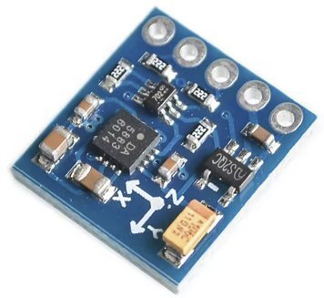

# compass

MicroPython firmware that reads a QST QMC5883P 3-axis magnetometer and streams
raw X/Y/Z field counts, their smoothed (moving-average) counterparts, and a
heading computed from the smoothed field as JSON lines over USB-CDC at ~50 Hz.
A host FastAPI service fans the lines out over a WebSocket and serves a live
Plotly dashboard with a rotating compass rose driven by the smoothed signal.

## Layout
```
compass/
  firmware/main.py            chip-agnostic streaming loop, calls emit()
  viz/static/index.html       rotating compass rose + heading readout + raw + smoothed X/Y/Z chart
  tests/                      host pytest for the emit() schema
  outputs/                    build artifacts (UF2 + ESP32 bin)
  docker-compose.yaml         pi-compile / esp32-compile / esp32-flash / viz services
```

## Usage

### RP2040 / RP2350
1. Compile the firmware:
   ```bash
   docker compose up --build pi-compile
   ```
   A single Docker build compiles MicroPython for both boards and merges the UF2 outputs into one universal file at [outputs/app.rp2040.rp2350.uf2](outputs/app.rp2040.rp2350.uf2) that flashes correctly on either device.
2. Put the board in [bootloader mode](../microcontrollers.md#bootloader-mode).
3. Drag-and-drop [outputs/app.rp2040.rp2350.uf2](outputs/app.rp2040.rp2350.uf2) onto the mounted USB drive. The board ejects and reboots running the new firmware.

### ESP32-S3
1. Put the board in [bootloader mode](../microcontrollers.md#bootloader-mode) — the service fails fast if `/dev/ttyACM0` isn't present.
2. Compile and flash:
   ```bash
   docker compose run --rm --build esp32-flash
   ```
   Runs `esp32-compile` to produce [outputs/app.esp32-s3.bin](outputs/app.esp32-s3.bin), then immediately flashes it via `esptool.py` running inside the container.

### Web dashboard
With the board plugged in (`/dev/ttyACM0`):
```bash
docker compose up --build viz
```
Open `http://localhost:18501`. The connection pill turns green when the serial
port is open, and the compass rose, heading/cardinal readout, and the raw +
smoothed X/Y/Z line chart update in real time. The dashboard auto-reconnects if
you unplug and replug the board.

## Notes
- The firmware initialises I²C, scans for the QMC5883P at its fixed address
  `0x2C`, verifies the chip-ID, soft-resets, inverts X/Y (so `atan2(y, x)` reads
  the QMC5883L convention), selects ±2 G range, and enters a continuous-mode
  streaming loop that prints one JSON line per sample at ~50 Hz.
- Sample shape: `{"t": <ms>, "x"/"y"/"z": <raw LSB>, "xs"/"ys"/"zs": <smoothed LSB>,
  "heading_deg": <0–360>}`. The smoothed values are a per-axis moving average
  (equal to the raw reading until the window fills); the dashboard plots both
  raw and smoothed, while the needle/heading use only the smoothed values.
  Heading is `(degrees(atan2(ys, xs)) + 360) % 360` off the smoothed field (no
  hard/soft-iron calibration or declination correction).
  Diagnostic events use the `diag` namespace (`scan`, `no_device`, `init_err`,
  `mag_ok`, `read_err`, `ovl`). `ovl` edge-triggers when the field saturates
  (a magnet too close).
- LED indication is chip-aware — see the [Boot LED states table](../../firmware-packages/boot_status_led/README.md#boot-led-states)
  in the boot_status_led README.

## Hardware

| RP2040-Zero board | RP2350 | ESP32-S3-Zero | QMC5883P (GY-271) |
|:---:|:---:|:---:|:---:|
|  |  |  |  |

## Wiring

### QMC5883P magnetometer

```
                              ┌─────────────────────┐
                              │   ┌──────────────┐  │
                              │   │  QMC5883P IC │  │
                              │   │      ◎       │  │
                              │   └──────────────┘  │
                              │                     │
                5V ────► VCC ─┤                     │
               GND ────► GND ─┤   GY-271 BREAKOUT   │
               SCL ────► SCL ─┤                     │
               SDA ────► SDA ─┤                     │
                              │                     │
                              └─────────────────────┘
```

**Power:** the pictured GY-271 breakout carries an onboard 3.3 V LDO regulator
and I²C level shifters, so **VCC accepts 3–5 V** — 5 V is fine here. The bare
QMC5883P die itself is only 2.5–3.6 V; the board's regulator does the drop. If
you have a bare/unregulated variant instead, power VCC from **3V3**.

The QMC5883P responds at the fixed I²C address `0x2C` (not configurable). Same
SDA/SCL pins as the other projects — SDA=GP0 / SCL=GP1 on the RP boards,
SDA=GPIO1 / SCL=GPIO2 on the ESP32-S3 — via the shared `i2c_bus` package.

### RP2040-Zero

```
                                   ┌─── USB-C ───┐
                              ┌────┴─────────────┴────┐
                              │                       │
       QMC5883P VCC ◄───  5V ─┤                       ├─ 0  ────► QMC5883P SDA
       QMC5883P GND ◄─── GND ─┤                       ├─ 1  ────► QMC5883P SCL
                         3V3 ─┤                       ├─ 2
                          29 ─┤                       ├─ 3
                          28 ─┤                       ├─ 4
                          27 ─┤  [BOOT] (●) [RESET]   ├─ 5
                          26 ─┤        WS2812         ├─ 6
                          15 ─┤        on GP16        ├─ 7
                          14 ─┤                       ├─ 8
                              │    RP2040 BOARD       │
                              │                       │
                              └─┬────┬────┬────┬────┬─┘
                                │    │    │    │    │
                                13   12   11   10   9
```

The on-board WS2812 sits between the BOOT and RESET buttons on the RP2040-Zero board and is driven by GP16 — no external wiring required.

### ESP32-S3-Zero

```
                                   ┌─── USB-C ───┐
                              ┌────┴─────────────┴────┐
                              │                       │
       QMC5883P VCC ◄───  5V ─┤                       ├─ 13
       QMC5883P GND ◄─── GND ─┤                       ├─ 12
                         3V3 ─┤                       ├─ 11
       QMC5883P SDA ◄───   1 ─┤                       ├─ 10
       QMC5883P SCL ◄───   2 ─┤                       ├─ 9
                           3 ─┤  [BOOT] (●) [RESET]   ├─ 8
                           4 ─┤        WS2812         ├─ 43
                           5 ─┤        on GPIO21      ├─ 44
                           6 ─┤                       ├─ 14
                           7 ─┤   ESP32-S3-Zero       ├─ 15
                              │                       │
                              └─┬────┬────┬────┬────┬─┘
                                │    │    │    │    │
                                16   17   18   21   45
```

The on-board WS2812 is driven by GPIO21 — no external wiring required.

### RP2350

```
                                          ┌──── USB ────┐
                              ┌───────────┴─────────────┴───────────┐
                              │                                     │
       QMC5883P SDA ◄───   0 ─┤                                     ├─ VBUS ────► QMC5883P VCC
       QMC5883P SCL ◄───   1 ─┤                                     ├─ VSYS
       QMC5883P GND ◄─── GND ─┤                                     ├─ GND
                           2 ─┤                                     ├─ 3V3_EN
                           3 ─┤                                     ├─ 3V3
                           4 ─┤                                     ├─ ADC_VREF
                           5 ─┤                                     ├─ 28
                         GND ─┤   [BOOTSEL] (●) LED on WL_GPIO0     ├─ AGND
                           6 ─┤                                     ├─ 27
                           7 ─┤                                     ├─ 26
                           8 ─┤      RP2350                         ├─ RUN
                           9 ─┤                                     ├─ 22
                         GND ─┤                                     ├─ GND
                          10 ─┤                                     ├─ 21
                          11 ─┤                                     ├─ 20
                          12 ─┤                                     ├─ 19
                          13 ─┤                                     ├─ 18
                         GND ─┤                                     ├─ GND
                          14 ─┤                                     ├─ 17
                          15 ─┤                                     ├─ 16
                              │                                     │
                              └─────────────────────────────────────┘
```

VBUS is the 5 V USB rail; the GY-271's onboard regulator drops it to 3.3 V. On a
bare/unregulated board, take VCC from the `3V3` pin instead.
