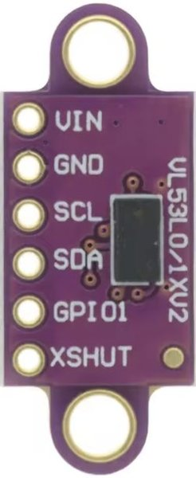

# distance-stream

MicroPython firmware that reads a VL53L0X time-of-flight sensor and
streams distance samples as JSON lines over USB-CDC at ~50 Hz. A host
FastAPI service serves a live Plotly dashboard.

## Layout
```
distance-stream/
  firmware/main.py            chip-agnostic streaming loop, calls emit()
  viz/static/index.html       Plotly line chart + distance readout
  tests/                      host pytest for the emit() schema
  outputs/                    build artifacts (UF2 + ESP32 bin)
  docker-compose.yaml         pi-compile / esp32-compile / esp32-flash / viz services
```

## Usage

### RP2040 / RP2350
1. Compile the firmware:
   ```bash
   docker compose up --build pi-compile
   ```
   A single Docker build compiles MicroPython for both boards and merges the UF2 outputs into one universal file at [outputs/app.rp2040.rp2350.uf2](outputs/app.rp2040.rp2350.uf2) that flashes correctly on either device.
2. Put the board in [bootloader mode](../../README.md#bootloader-mode).
3. Drag-and-drop [outputs/app.rp2040.rp2350.uf2](outputs/app.rp2040.rp2350.uf2) onto the mounted USB drive. The board ejects and reboots running the new firmware.

### ESP32-S3
1. Put the board in [bootloader mode](../../README.md#bootloader-mode) — the service fails fast if `/dev/ttyACM0` isn't present.
2. Compile and flash:
   ```bash
   docker compose run --rm --build esp32-flash
   ```
   Runs `esp32-compile` to produce [outputs/app.esp32-s3.bin](outputs/app.esp32-s3.bin), then immediately flashes it via `esptool.py` running inside the container.

### Web dashboard
With the board plugged in (`/dev/ttyACM0`):
```bash
docker compose up --build viz
```
Open `http://localhost:18501`. The connection pill turns green when the
serial port is open, and the distance readout + line chart update in
real time.

## Notes
- The firmware initialises I²C, finds the VL53L0X at `0x29`, then enters
  a streaming loop that prints one JSON line per sample
  (`{"t": <ms>, "distance_mm": <int|null>}`) at ~50 Hz.
  `distance_mm` is `null` when the sensor returns `>= 8190` (out of range).
- A FastAPI container reads `/dev/ttyACM0`, fans the JSON lines out over
  a WebSocket, and serves the dashboard at `http://localhost:18501`.
- LED indication is chip-aware — see the [Boot LED states table](../../README.md#boot-led-states)
  in the repo README.

## Hardware

| RP2040-Zero board | RP2350 | ESP32-S3-Zero | VL53L0X ToF sensor |
|:---:|:---:|:---:|:---:|
|  |  |  |  |

## Wiring

### VL53L0X ToF sensor

```
                              ┌─────────────────────┐
                              │   ┌──────────────┐  │
                              │   │  VL53L0X IC  │  │
                              │   │      ◎       │  │
                              │   └──────────────┘  │
                              │                     │
                5V ────► VIN ─┤                     │
               GND ────► GND ─┤   BREAKOUT BOARD    │
               GP1 ────► SCL ─┤                     │
               GP0 ────► SDA ─┤                     │
                              │                     │
                              └─────────────────────┘
```

### RP2040-Zero

```
                                   ┌─── USB-C ───┐
                              ┌────┴─────────────┴────┐
                              │                       │
        VL53L0X VIN ◄───  5V ─┤                       ├─ 0  ────► VL53L0X SDA
        VL53L0X GND ◄─── GND ─┤                       ├─ 1  ────► VL53L0X SCL
                         3V3 ─┤                       ├─ 2
                          29 ─┤                       ├─ 3
                          28 ─┤                       ├─ 4
                          27 ─┤  [BOOT] (●) [RESET]   ├─ 5
                          26 ─┤        WS2812         ├─ 6
                          15 ─┤        on GP16        ├─ 7
                          14 ─┤                       ├─ 8
                              │    RP2040 BOARD       │
                              │                       │
                              └─┬────┬────┬────┬────┬─┘
                                │    │    │    │    │
                                13   12   11   10   9
```

The on-board WS2812 sits between the BOOT and RESET buttons on the RP2040-Zero board and is driven by GP16 — no external wiring required.

### ESP32-S3-Zero

```
                                   ┌─── USB-C ───┐
                              ┌────┴─────────────┴────┐
                              │                       │
        VL53L0X VIN ◄───  5V ─┤                       ├─ 13
        VL53L0X GND ◄─── GND ─┤                       ├─ 12
                         3V3 ─┤                       ├─ 11
        VL53L0X SDA ◄───   1 ─┤                       ├─ 10
        VL53L0X SCL ◄───   2 ─┤                       ├─ 9
                           3 ─┤  [BOOT] (●) [RESET]   ├─ 8
                           4 ─┤        WS2812         ├─ 43
                           5 ─┤        on GPIO21      ├─ 44
                           6 ─┤                       ├─ 14
                           7 ─┤   ESP32-S3-Zero       ├─ 15
                              │                       │
                              └─┬────┬────┬────┬────┬─┘
                                │    │    │    │    │
                                16   17   18   21   45
```

The on-board WS2812 is driven by GPIO21 — no external wiring required.

### RP2350

```
                                          ┌──── USB ────┐
                              ┌───────────┴─────────────┴───────────┐
                              │                                     │
        VL53L0X SDA ◄───   0 ─┤                                     ├─ VBUS ────► VL53L0X VIN
        VL53L0X SCL ◄───   1 ─┤                                     ├─ VSYS
        VL53L0X GND ◄─── GND ─┤                                     ├─ GND
                           2 ─┤                                     ├─ 3V3_EN
                           3 ─┤                                     ├─ 3V3
                           4 ─┤                                     ├─ ADC_VREF
                           5 ─┤                                     ├─ 28
                         GND ─┤   [BOOTSEL] (●) LED on WL_GPIO0     ├─ AGND
                           6 ─┤                                     ├─ 27
                           7 ─┤                                     ├─ 26
                           8 ─┤      RP2350                         ├─ RUN
                           9 ─┤                                     ├─ 22
                         GND ─┤                                     ├─ GND
                          10 ─┤                                     ├─ 21
                          11 ─┤                                     ├─ 20
                          12 ─┤                                     ├─ 19
                          13 ─┤                                     ├─ 18
                         GND ─┤                                     ├─ GND
                          14 ─┤                                     ├─ 17
                          15 ─┤                                     ├─ 16
                              │                                     │
                              └─────────────────────────────────────┘
```
