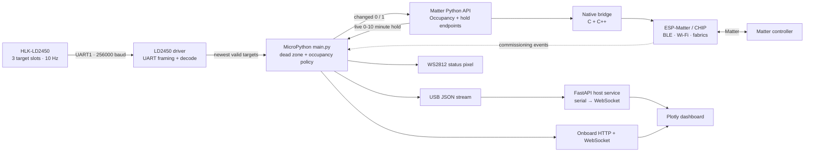
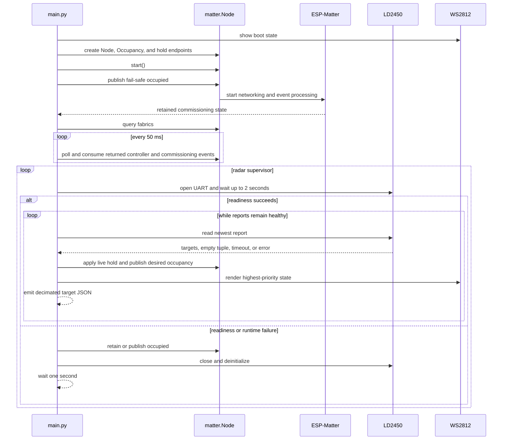
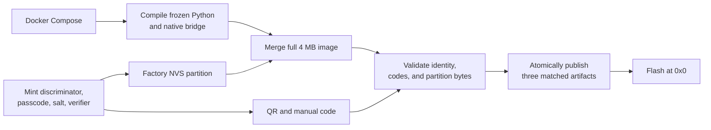

# ESP32-S3-Zero Matter occupancy sensor

This project exposes an HLK-LD2450 mmWave radar as a read-only Matter Occupancy
Sensor and a virtual Dimmable Light that configures its occupancy hold. It is an
edge translator: detailed 10 Hz radar reports become a low-bandwidth Matter
occupancy state, while full target telemetry remains available through the
board's webpage or a local USB dashboard.

The product contract is:

- Boot and radar recovery begin occupied with no retained clear timer.
- A valid report with at least one target outside the 10 mm radial dead zone is
  occupied immediately.
- The first valid empty report starts the controller-selected hold. A zero hold
  may publish clear on that same report.
- Further valid empty reports remain occupied until the hold expires.
- Reacquiring a target cancels the pending clear.
- A missing report or UART failure forces occupied and starts full radar
  recreation at a fixed one-second interval.
- Matter publication failures leave the desired value pending without affecting
  radar health or recovery.
- Matter snapshot failures force and retain occupied, show the yellow product
  failure state, and retry every 50 ms without restarting radar or dashboard.

The endpoint declares PIR because Matter has no radar sensing modality.

## Occupancy hold control

The second Matter endpoint appears to controllers as a Dimmable Light, but it
does not drive the onboard status pixel. Its brightness is a continuous timing
control: Matter level 0-254, normally displayed as 0-100 percent, maps linearly
to 0-10 minutes. Turning the virtual light off selects zero delay; turning it on
uses its current brightness.

Matter persists the virtual light's power and brightness. A newly added endpoint
starts off, preserving immediate clearing until a controller configures it. If
the setting changes during a countdown, the new duration applies to the original
empty-transition time: shortening may clear on the next valid empty report,
while extending pushes the deadline out.

Only valid reports advance the policy. A radar failure discards the empty-start
timestamp, forces occupied, and begins a new observation period after recovery.
If the dimmer state cannot be read, the firmware also cancels the timer and
retains occupied, but it leaves the healthy radar connection running.

The policy has three explicit states:

| State | Matter occupancy | Meaning |
| --- | --- | --- |
| `OCCUPIED` | 1 | Boot, recovery, a target observation, or a fail-safe fault value |
| `EMPTY_HOLD` | 1 | Valid empty reports are continuing while the live hold runs |
| `VACANT` | 0 | Valid empty reports continued through the selected hold |

The clear timer uses wrap-safe monotonic ticks and always remains anchored to
the first empty report. Turning the virtual light off selects zero milliseconds;
turning it on maps level 0-254 linearly to 0-600,000 ms.

## System architecture



Matter occupancy and dashboard telemetry are independent outputs. Dashboard
failures do not affect occupancy publication or commissioning.

### Responsibility boundaries

| Layer | Responsibility |
| --- | --- |
| Project firmware | Board pins, dead zone, occupancy/hold policy, retry behavior, LED arbitration, and JSON schema |
| `firmware-packages/ld2450` | UART ownership, IRQ wakeup, byte framing, resynchronization, and target decoding |
| Matter Python package | Endpoint validation, Python attribute mirror, returned events, and node administration |
| Native Matter bridge | CHIP-task scheduling, coalesced state snapshots, Occupancy publication, and commissioning recovery |
| ESP-Matter / CHIP | BLE and Wi-Fi commissioning, secure sessions, fabrics, persistence, and controller reporting |
| Host dashboard | USB reconnection, JSON filtering, WebSocket fan-out, and visualization |

Product behavior stays in `firmware/main.py`; the radar driver and Matter
bridge contain no board pins, dead-zone rules, or pixel colors. See
[`../../firmware-packages/matter/ARCHITECTURE.md`](../../firmware-packages/matter/ARCHITECTURE.md)
for the native call paths and task boundaries.

## Runtime flow



Matter starts before radar initialization, so a missing radar does not prevent
commissioning or fabric administration.

### Radar ingestion

The LD2450 sends one fixed 30-byte report approximately every 100 ms. Each
report contains three eight-byte target slots. The reusable driver is designed
for bounded memory and current data:

- A UART receive-idle interrupt only wakes the asyncio reader; UART reads and
  decoding run outside the interrupt.
- A 512-byte UART ring holds about 1.7 seconds of documented traffic.
- Reused 120-byte and 30-byte buffers avoid repeated allocation.
- Header and trailer markers frame reports and recover synchronization after
  invalid bytes.
- When reports accumulate, the driver validates them all but decodes only the
  newest one.

The driver returns:

| Result | Meaning |
| --- | --- |
| Tuple with targets | Current detected targets |
| Empty tuple | Valid report with no targets |
| `None` | No complete valid report within 500 ms |
| `DeviceNotFoundError` | No valid startup report within two seconds |
| `OSError` | UART initialization or read failure |

The driver reads the factory 256000-baud, 8-N-1 stream and never changes radar
settings. Only one coroutine may wait on it at a time. On ESP32-S3,
MicroPython implements `UART.IRQ_RXIDLE` with `Timer(0)`, which this project
reserves for the driver.

### Occupancy decision and failure handling

Targets whose squared distance is less than `10² mm²` are discarded because
near-field reports can collapse toward the origin as tracking ends. Occupancy
turns on as soon as the remaining target tuple becomes non-empty. Its falling
edge is delayed by the virtual dimmer and canceled if a target returns.

| Condition | Diagnostic | Product behavior |
| --- | --- | --- |
| No valid startup report | `no_device` | Force occupied, close the driver, and recreate after one second |
| UART initialization failure | `init_err` | Force occupied and retry construction after one second |
| UART read failure | `read_err` | Force occupied, close the driver, and recreate after one second |
| No report for 500 ms | `report_timeout` | Force occupied, close the driver, and recreate after one second |
| Newly created radar becomes ready | `radar_ok` | Start a fresh occupied observation period and resume reports |
| Dimmer state cannot be read | Hold-control error event | Retain occupied and cancel the timer without recreating the radar |
| Matter publication fails | Matter error event | Leave the transition pending so the next report retries it |
| Matter snapshot fails | `matter_poll_err` | Force occupied, keep other tasks alive, and retry after 50 ms |
| Matter snapshot recovers | `matter_ok` | Clear synchronization failure; the next valid radar report resumes vacancy timing |

Only the first category diagnostic is emitted during one uninterrupted radar
failure period. Repeated readiness failures remain in the same one-second
recovery loop until a completely new driver receives a valid report. Radar
recovery ends the failure period, emits `radar_ok`, and resumes from occupied
without any elapsed empty time. A Matter polling failure is a separate failure
domain: it forces occupied because the live hold may be stale, but never closes
the radar or dashboard. Dashboard and commissioning failures do not recreate
the radar.

## Matter boundary and concurrency

Publishing `occupancy.set(occupancy=...)` crosses four layers:

1. The Python endpoint validates the value as integer `0` or `1` and updates
   its local mirror.
2. The `_matter` MicroPython module converts it to a tagged native scalar.
3. The C++ bridge schedules a bounded request onto the CHIP task.
4. The native `OccupancySensingCluster` setter changes and reports the value
   visible to controllers.

Occupancy uses the cluster setter because ESP-Matter serves it through a
code-driven cluster rather than its generic attribute store. Python-to-CHIP
requests wait for at most 250 ms, turning a stalled stack into `OSError` instead
of indefinitely blocking the MicroPython scheduler.

CHIP callbacks never invoke Python directly. They overwrite fixed native
records for each mirrored attribute plus independent commissioning session and
window state. One shared revision preserves cross-kind order. The MicroPython
application calls `Node.poll()` every 50 ms; unchanged generations avoid the
bounded CHIP-task snapshot request, and failed requests remain pending for the
next poll. Successful calls return ordered immutable controller and
commissioning events after synchronizing the endpoint mirrors. Repeated writes
to one path may coalesce to the latest value.

## Commissioning and status pixel

The onboard WS2812 on GPIO21 displays commissioning state first, then radar
health and occupancy. Brightness is capped at ten percent.

| Pixel | Meaning |
| --- | --- |
| Dim white | Firmware running; ESP-Matter has reported no state yet |
| Purple | A commissioning window is open |
| Cyan | A commissioner is connected |
| Red | The latest commissioning attempt failed |
| Amber | Unpaired and no longer advertising |
| Yellow | Radar reports or Matter synchronization are unhealthy |
| Green | Occupied |
| Blue | Clear |

Pairing outranks radar state even on a commissioned board, allowing an owner
adding another controller to observe the attempt. After pairing settles, a
commissioned node returns to radar health and occupancy.

Amber represents an invariant violation: an unpaired node should always be
advertising. The native bridge attempts to reopen commissioning after an
unpaired session stops, an inactive window expires, or the final fabric is
removed. It first tries BLE plus DNS-SD and falls back to DNS-SD alone when BLE
is unavailable.

## USB serial and dashboard

At most once every 500 ms, the newest valid report produces one compact JSON
line containing targets outside the dead zone. Raw sensor fields are preserved:

```json
{"t":1234,"targets":[{"slot":1,"x_mm":-782,"y_mm":1713,"speed_cm_s":-16,"resolution_mm":320}]}
```

The host service reads USB serial in a background thread, rejects non-JSON
lines, and sends valid objects through a bounded asyncio queue to WebSocket
clients. The browser derives distance, angle, and occupancy, displays
five-second target trails, and retains 60 seconds of activity. Radar, serial,
or WebSocket loss returns the dashboard to `WAITING` rather than clear.

Start it at <http://localhost:18501>:

```console
docker compose up --build viz
```

Set `SERIAL_PORT=/dev/ttyACM1` when the board is not `/dev/ttyACM0`.

## The board's own dashboard

The board automatically serves the same dashboard from the address Matter
commissioning put it on. To avoid overlapping the Matter startup current peak,
the firmware waits 15 seconds after boot before opening port 80, then starts the
listener as soon as an address is available. The build gzips
`viz/static/index.html` into the firmware. There is one copy of the page:
whatever the `viz` service above shows is what the board shows.

The address is reported once it exists, and again if the DHCP lease changes it:

```json
{"event":"dashboard","state":"ready","url":"http://192.168.1.50/"}
```

Read it with `docker compose run --rm --build esp32-monitor`, then open that URL.
Nothing is served during the protected startup interval or before commissioning,
because until then the listener is delayed or the board has no address. Serial
output remains available at a power-conscious two reports per second; the
WebSocket is a second destination for those same lines, not a replacement.

The page still loads Plotly from `cdn.plot.ly`, so the **viewing device** needs
internet access for the charts; the board itself does not. Up to three browsers
can watch at once, and a fourth is refused rather than served slowly.

## Build, artifacts, and flashing

Docker is the only host dependency. The build uses pinned ESP-IDF, ESP-Matter,
Connected Home over IP, and MicroPython sources.



Run from this directory:

```console
docker compose up --build --exit-code-from esp32-compile esp32-compile
docker compose run --rm --build esp32-flash
docker compose run --rm --build esp32-monitor
```

Each build produces a matched set under `outputs/`:

- `app.esp32-s3.bin`: merged 4 MB flash image
- `app.esp32-s3.qr.png`: commissioning QR code
- `app.esp32-s3.setup.txt`: manual code and setup payload

The build normally mints a fresh passcode as well as a fresh discriminator and
salt. The factory partition stores the SPAKE2+ verifier and salt, not the
plaintext passcode. Before publication, the build independently decodes both
onboarding codes, checks their identity against the board configuration,
verifies the factory partition inside the merged image, and atomically exposes
the three artifacts.

Keep the files together and use the codes generated for the image being
flashed. The named `matter-build-cache` volume preserves incremental compiler
state; `docker compose down --volumes` forces a clean compile.

Flashing writes the complete image at `0x0`, including Matter persistence and
factory data. Remove an older instance of the accessory from its controller
before commissioning the newly flashed image.

## Commissioning and administration

In Apple Home, choose **Add Accessory** and scan
`outputs/app.esp32-s3.qr.png`, or enter the manual code from
`outputs/app.esp32-s3.setup.txt`. Complete the prompts for 2.4 GHz Wi-Fi and
room assignment, then compare Home's Occupancy value with the onboard pixel.

A commissioned device does not reopen its initial BLE window on every boot.
Factory-reset it from an interrupted MicroPython REPL with:

```console
MONITOR_INTERRUPT=1 MONITOR_SEND='node.factory_reset()' docker compose run --rm esp32-monitor
```

`node.remove_fabric(index)` removes one fabric instead. Use the commissioning
artifacts matching the flashed image after either operation.

## Wiring

Connect board TX to radar RX and board RX to radar TX. Power the radar from 5 V
with more than 200 mA available, not from 3V3.

| ESP32-S3-Zero | UART role | HLK-LD2450 | Purpose |
| --- | --- | --- | --- |
| `5V` | — | `5V` | Radar power |
| `GND` | — | `GND` | Common power and signal ground |
| `GPIO5` | UART1 TX | `RX` | MCU commands to radar |
| `GPIO6` | UART1 RX | `TX` | Radar reports to MCU |

## Design tradeoffs and production considerations

- Matter controllers cannot observe radar health directly; health is available
  through the pixel and serial diagnostics while the occupancy endpoint is
  driven to its fail-safe occupied value.
- Occupancy means any target outside the artifact dead zone. There are no
  configurable zones or confidence thresholds; the dimmer supplies one global
  clear hold.
- Radar slots are current report positions, not persistent person identities.
- The firmware configures one occupancy endpoint, one virtual dimmer, and
  disables OTA.
- The current VID, PID, and example device-attestation provider are development
  settings and must be replaced for a production device.
- The dashboard loads Plotly from a CDN and therefore is not fully offline.

The architectural invariant is: the radar driver decides what bytes mean,
project firmware decides what occupancy means, and the Matter bridge decides
how that state crosses task and protocol boundaries.
