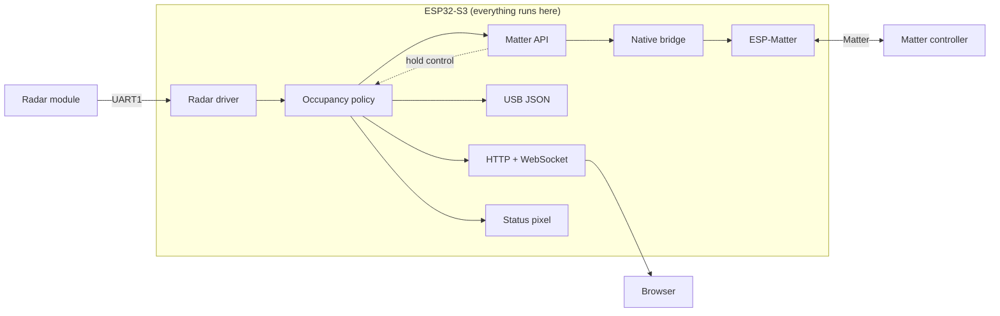
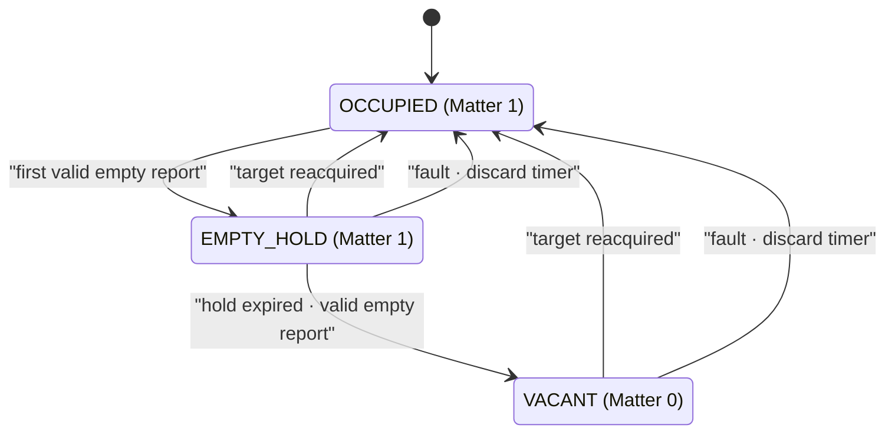
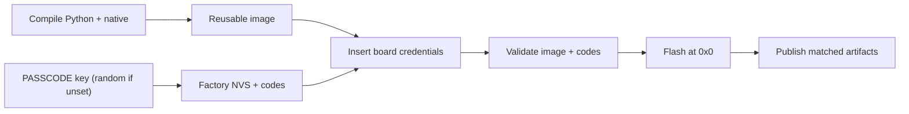

# ESP32-S3-Zero Matter occupancy sensor

This firmware combines an ESP32-S3 and an HLK-LD2450 or HLK-LD2420 radar into a Matter Occupancy Sensor. Once the device joins the network, open its IP address in a browser to view a live dashboard of its radar readings.

**Occupancy timeout:** the device also appears as a virtual Dimmable Light. Its brightness slider sets how long the sensor keeps reporting occupied after you leave the radar's detection range, so lights automated from it don't switch off the moment you step out of view. Sliding from 0% to 100% sets the timeout from 0 to 10 minutes, and turning the light off removes the delay entirely. Matter remembers the setting across reboots.

## Architecture



Dashboard failures leave Matter, radar, occupancy, and the status pixel
unchanged. Commissioning starts before radar initialization, so absent hardware
does not prevent pairing or administration.

## Components

Product policy stays in the project; reusable packages own mechanisms.

| Unit | Responsibility |
| --- | --- |
| `main.py` | Board wiring, task flow, radar recovery, Matter publication, target telemetry. |
| `reports.py` | Occupancy hold, dead zone, and telemetry pacing, decided from explicit report times. |
| `webserver.py` | Dashboard routes, WebSocket viewer, report queue, address announcements, bounded sockets, cleanup, recovery. |
| `status.py` | Commissioning state, LED color priority, suppression of repeated pixel writes. |
| `radar` | Probe order, UART ownership, framing, newest decoded targets. |
| `matter` | Validation, mirrors, bounded task crossing, retained events. |
| ESP-Matter | Sessions, commissioning, fabrics, persistence, subscriptions. |
| Microdot | HTTP and WebSocket handling, with routes defined in project firmware. |

`main.py` runs three asyncio tasks: Matter polling every 50 ms, dashboard address
checks every 1 s after a 15 s boot delay, and radar reading with 1 s recovery
retries. `WebServer` receives only a port label, an address lookup, and the
emitted JSON lines.

## Key flows

**Occupancy** is decided and published before any telemetry work.



Only valid reports advance vacancy; zero hold clears on the first empty report.
Hold changes apply to the original empty timestamp.

**Telemetry** emits changed targets at most every 500 ms to USB serial and the
dashboard:

```json
{"t":1234,"targets":[{"slot":1,"x_mm":-782,"y_mm":1713,
"speed_cm_s":-16,"resolution_mm":320}]}
```

The dashboard announces its address:

```json
{"event":"dashboard","state":"ready","url":"http://192.168.1.50/"}
```

## Contract and failures

Occupancy fails safe when the radar or live hold cannot be trusted: boot, radar
faults, and Matter poll faults force occupied and discard the hold timer.
Controllers see only this occupancy; health shows on the pixel and in
diagnostics. Any target at least 10 mm from the origin occupies immediately.

A failed occupancy publication retries on the next report; a failed Matter poll
retries without restarting radar or dashboard. Radar and Matter diagnostics are
`no_device`, `init_err`, `read_err`, `report_timeout`, `radar_ok`,
`matter_poll_err`, and `matter_ok`; Matter publication and dashboard failures use
error events.

Pixel priority is red failed pairing, purple open window, cyan active pairing,
amber unpaired/closed or dim white startup, yellow unhealthy radar/Matter,
then blue vacant or green occupied.

VID/PID and test DACs are development settings; replace them for production.

The dashboard needs no internet access: the firmware serves one self-contained
gzipped page at `/` and streams JSON at `/ws` to one viewer. Its four SVG charts
are display-only and stack on phones and tablets. A full report queue drops its
oldest report, and socket writes happen outside the radar and Matter tasks.

| Resource | Limit |
| --- | --- |
| Listen backlog / active connections / viewers | 2 / 2 / 1 |
| Maximum connection lifetime | 10 minutes, including idle time |
| Connection admission rate / burst | 2 per second / 4 |
| HTTP request / line including CRLF / header fields | 2,048 bytes / 256 bytes / 32 |
| Absolute HTTP request / response deadlines | 2 seconds / 5 seconds |
| Stalled socket write / complete WebSocket write | 1 second / 1 second including lock wait |
| Socket write slice / polling sleep | 512 bytes / 10 ms |
| Telemetry queue / encoded payload | 2 messages / 1,024 bytes |
| Incoming control payload / frame deadline | 125 bytes / 1 second from first byte |
| Control rate / burst | 4 per second / 4 |

Excess connections close before a handler is created. Request bodies, transfer
encoding, duplicate headers, and malformed or oversized input are rejected.
Ordinary HTTP connections close after one response. WebSocket input accepts only
masked, final ping/pong/close frames. Control replies and telemetry share a write
lock, and disconnects release the sender and queue.

A disconnected browser shows a **Take connection** button. It opens
`/ws?takeover=1`, which closes the current viewer and waits for its tasks to
finish before handing over the slot; invalid WebSocket upgrades cannot displace a
viewer. After a failure, expiry, takeover, or hidden page, browsers reconnect only
on that click, so a displaced viewer never reclaims the slot on its own.

The server checks free MicroPython heap every 100 ms. Below 64 KiB it closes the
listener and clients and cancels dashboard work. Allocation failures and socket
resource exhaustion take the same path. After joining the tasks and collecting
garbage, recovery requires at least 96 KiB free. Retries start at 5 seconds and
double to 60 seconds; 60 healthy seconds reset the delay. Other peer errors affect
only that connection.

Each lifecycle change emits `{"diag":"web","state":...}`: `stopped` at boot,
`running`, or `cooldown` with reason `heap`, `memory`, or `socket`. The dashboard
URL is announced only when listening, including after recovery. These limits
bound Python network work; native Wi-Fi/lwIP memory and responsiveness under
sustained network load are not yet validated on the board alongside Matter.

Microdot 2.6.2 is locked in `uv.lock`. The `firmware-dependencies` stage of
`Dockerfile.host` copies its Python sources and license, and `manifest.py`
freezes it into any firmware that imports it.

## Build, flash, wire

Compile reusable firmware, then provision and flash each board from this directory.



```console
docker compose up --build esp32-compile
docker compose run --rm --build esp32-flash
docker compose run --rm --build esp32-monitor
```

Compilation publishes only `outputs/app.esp32-s3.bin` and removes stale pairing
artifacts. Each flash then publishes that board's image, `app.esp32-s3.qr.png`, and
`app.esp32-s3.setup.txt`, replacing the previous board's; pair with those. The
setup text also records the board's `passcode` key, so keep it secret.

Reboots keep the flashed credentials, but each flash draws a new key unless
`PASSCODE` is set; see [Pairing](../../firmware-packages/matter/README.md#pairing).
Add `--no-deps` to flash another board without recompiling.

Factory-reset through the interrupted REPL:

```console
docker compose run --rm -e MONITOR_INTERRUPT=1 \
  -e 'MONITOR_SEND=import _matter; _matter.factory_reset()' esp32-monitor
```

Cross UART1 TX/RX and share ground; supply LD2450 with over 200 mA available.

| Board | LD2450 | LD2420 |
| --- | --- | --- |
| `5V` | `5V` power | — |
| `3V3` | — | `3V3` power |
| `GND` | `GND` | `GND` |
| `GPIO5` TX | `RX` | `RX` |
| `GPIO6` RX | `TX` | `OT1` |
| `GPIO21` | Onboard pixel | Onboard pixel |
| Unconnected | — | `OT2` |

See also [radar](../../firmware-packages/radar/README.md),
[Matter](../../firmware-packages/matter/README.md), and
[build tooling](../../tools/AGENTS.md).
