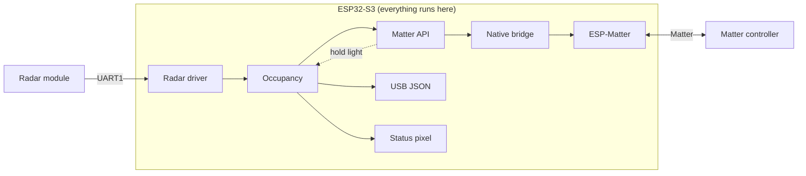
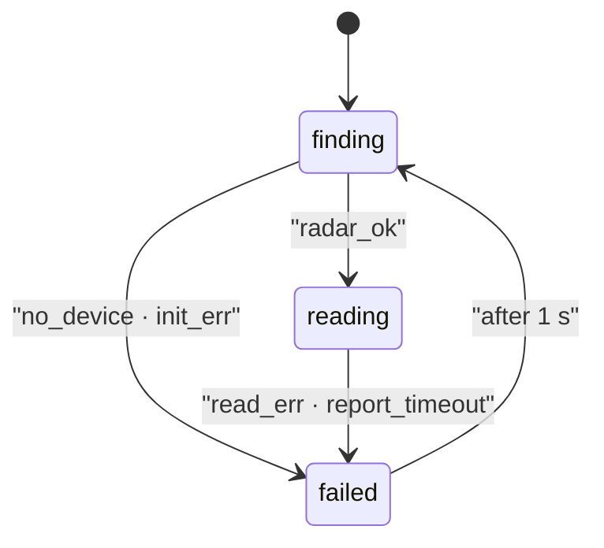
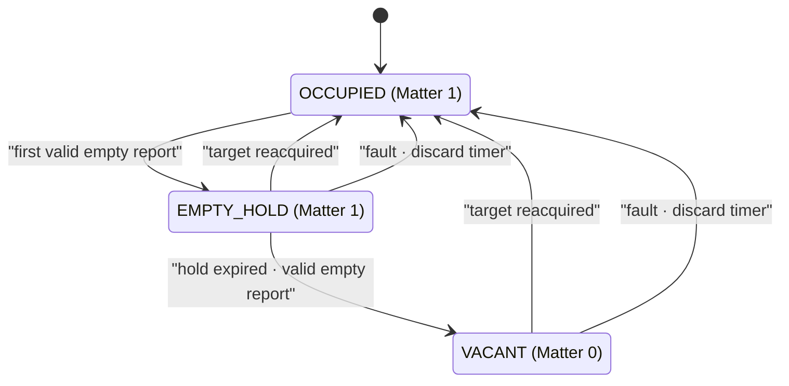
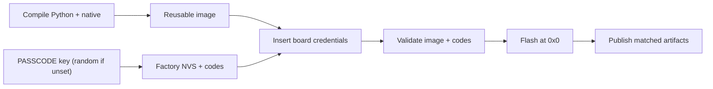

# ESP32-S3-Zero Matter occupancy sensor

This firmware combines an ESP32-S3 and an HLK-LD2450 or HLK-LD2420 radar into a Matter Occupancy Sensor.

**Occupancy timeout:** the device also appears as a virtual Dimmable Light. Its brightness slider sets how long the sensor keeps reporting occupied after you leave the radar's detection range, so lights automated from it don't switch off the moment you step out of view. Sliding from 0% to 100% sets the timeout from 0 to 10 minutes, and turning the light off removes the delay entirely. Matter remembers the setting across reboots.

## Architecture


```mermaid
flowchart LR
    radar["Radar module"]
    controller["Matter controller"]
    subgraph board["ESP32-S3 (everything runs here)"]
        driver["Radar driver"] --> policy["Occupancy"]
        policy --> matter["Matter API"] --> native["Native bridge"]
        native --> stack["ESP-Matter"]
        matter -.->|"hold light"| policy
        policy --> serial["USB JSON"]
        policy --> pixel["Status pixel"]
    end
    radar -->|"UART1"| driver
    stack <-->|"Matter"| controller
```

Commissioning starts before radar initialization, so absent hardware does not
prevent pairing or administration.

## Components

Product policy stays in the project; reusable packages own mechanisms.

| Unit | Responsibility |
| --- | --- |
| `main.py` | Pins, hardware, both loops and their states, and `Occupancy`, which shows occupancy on Matter and the pixel. Read it to audit every output. |
| `hold.py` | Occupancy hold state machine, and the hold light's level in milliseconds. |
| `targets.py` | Dead zone and telemetry pacing, decided from explicit report times. |
| `status.py` | Product colour for radar and Matter health and for occupancy. |
| `radar` | Probe order, UART ownership, framing, newest decoded targets. |
| `matter` | Validation, mirrors, fabric and network state, bounded task crossing, retained events. |
| `matter.status_led` | Matter state colour and blink, failure flash, pixel writes. |
| ESP-Matter | Sessions, commissioning, fabrics, persistence, subscriptions. |

## Loops

`main.py` runs two asyncio loops. Both update one `Occupancy`, and each change
sets the pixel's product colour and publishes occupancy if it changed.

**Matter** polls every 50 ms and steps the pixel's blink each pass. Each change
of Matter state goes to the pixel and out as JSON lines. While polls fail,
occupancy holds occupied; the first failure reports `matter_poll_err` and the
next good poll `matter_ok`.

**Radar** finds the radar, reads it, and finds it again after any failure:


```mermaid
stateDiagram-v2
    [*] --> finding
    finding --> reading: "radar_ok"
    finding --> failed: "no_device · init_err"
    reading --> failed: "read_err · report_timeout"
    failed --> finding: "after 1 s"
```

In `failed`, occupancy holds occupied, only the first failure of a run is
reported, and the radar's UART is closed.

## Key flows

**Occupancy** is decided and published before any telemetry work.


```mermaid
stateDiagram-v2
    state "OCCUPIED (Matter 1)" as occupied
    state "EMPTY_HOLD (Matter 1)" as holding
    state "VACANT (Matter 0)" as vacant
    [*] --> occupied
    occupied --> holding: "first valid empty report"
    holding --> vacant: "hold expired · valid empty report"
    holding --> occupied: "target reacquired"
    vacant --> occupied: "target reacquired"
    holding --> occupied: "fault · discard timer"
    vacant --> occupied: "fault · discard timer"
```

Only valid reports advance vacancy; zero hold clears on the first empty report.
Hold changes apply to the original empty timestamp.

**Telemetry** emits changed targets at most every 500 ms to USB serial:

```json
{"t":1234,"targets":[{"slot":1,"x_mm":-782,"y_mm":1713,
"speed_cm_s":-16,"resolution_mm":320}]}
```

## Contract and failures

Occupancy fails safe when the radar or live hold cannot be trusted: boot, radar
faults, and Matter poll faults force occupied and discard the hold timer.
Controllers see only this occupancy; health shows on the pixel and in
diagnostics. Any target at least 10 mm from the origin occupies immediately.

A failed occupancy publication retries on the next report; a failed Matter poll
retries without restarting the radar. Radar and Matter diagnostics are
`no_device`, `init_err`, `read_err`, `report_timeout`, `radar_ok`,
`matter_poll_err`, and `matter_ok`; Matter publication failures use error events.

The pixel shows the Matter state first, using the shared
[matter.status_led](../../firmware-packages/matter/README.md#status-pixel)
patterns: three red flashes for a failed pairing attempt, dim white before the
first poll, fast cyan blink while pairing, slow purple blink while a window is
open, solid amber when unpaired with no window, and slow amber blink when
paired but off Wi-Fi. Once paired and connected, it shows the product: solid
yellow for unhealthy radar or Matter polling, then blue vacant or green
occupied.

VID/PID and test DACs are development settings; replace them for production.

## Tests

From the repository root:

```console
docker compose run --rm --build pytest /projects/matter-radar-sensor/tests
```

`tests/test_scenarios.py` has one row per line of this contract. Each row runs
the real `main()` on [a virtual bench](tests/radar_sensor_bench.py) that fakes
only the clock, the radar on UART1, and the Matter controller.

## Build, flash, wire

Compile reusable firmware, then provision and flash each board from this directory.


```mermaid
flowchart LR
    compile["Compile Python + native"] --> image["Reusable image"]
    key["PASSCODE key (random if unset)"] --> credentials["Factory NVS + codes"]
    image --> merge["Insert board credentials"]
    credentials --> merge
    merge --> validate["Validate image + codes"] --> flash["Flash at 0x0"]
    flash --> publish["Publish matched artifacts"]
```

```console
docker compose up --build esp32-compile
docker compose run --rm --build esp32-flash
docker compose run --rm --build esp32-monitor
```

Compilation publishes only `outputs/app.esp32-s3.bin` and removes stale pairing
artifacts. Each flash then publishes that board's image, `app.esp32-s3.qr.png`, and
`app.esp32-s3.setup.txt`, replacing the previous board's; pair with those. The
setup text also records the board's `passcode` key, so keep it secret.

Reboots keep the flashed credentials, but each flash draws a new key unless
`PASSCODE` is set; see [Pairing](../../cpython-packages/matter_tools/README.md#pairing).
Add `--no-deps` to flash another board without recompiling.

Factory-reset through the interrupted REPL:

```console
docker compose run --rm -e MONITOR_INTERRUPT=1 \
  -e 'MONITOR_SEND=import matter_native; matter_native.factory_reset()' esp32-monitor
```

Cross UART1 TX/RX and share ground; supply LD2450 with over 200 mA available.

| Board | LD2450 | LD2420 |
| --- | --- | --- |
| `5V` | `5V` power | — |
| `3V3` | — | `3V3` power |
| `GND` | `GND` | `GND` |
| `GPIO5` TX | `RX` | `RX` |
| `GPIO6` RX | `TX` | `OT1` |
| `GPIO21` | Onboard pixel | Onboard pixel |
| Unconnected | — | `OT2` |

See also [radar](../../firmware-packages/radar/README.md),
[Matter](../../firmware-packages/matter/README.md), and
[build tooling](../../tools/AGENTS.md).
