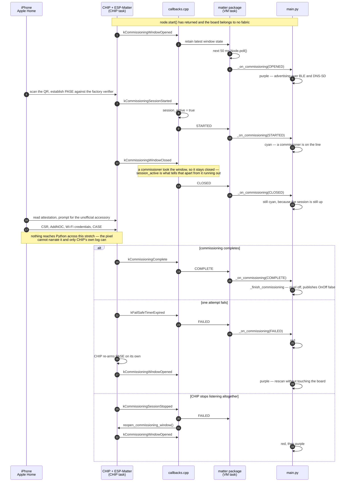

# ESP32-S3-Zero Matter Color Light

This project exposes the ESP32-S3-Zero's onboard WS2812 on GPIO21 as a Matter
Extended Color Light. ESP-Matter handles commissioning and protocol state;
`firmware/main.py` sets up the node and owns the pixel, and `firmware/color/`
turns the endpoint into a plain RGB colour, so setting the LED is one call:

```python
set_color((0, 25, 0))   # green at ten percent, on the strip and in the home
```

`main.py` is the only file in the project that imports `matter`, because that is
where the service is set up.

## What the pixel is telling you

Until the board is paired the pixel is a commissioning indicator, so you can
follow a pairing attempt without a serial monitor attached:

| Pixel | Meaning |
| --- | --- |
| Dim white | Firmware running, ESP-Matter has reported nothing yet |
| Steady purple | A commissioning window is open, nobody has engaged |
| Steady cyan | A commissioner is talking to the board |
| Solid red | The last attempt failed; purple follows within moments |
| Steady amber | Unpaired and advertising nothing — nobody can reach it |
| Off | Commissioned; the pixel now belongs to the controller |

Amber is the one that should never appear. An unpaired board is meant to always
be advertising, and `firmware-packages/matter` reopens a window whenever the
stack would otherwise go quiet, so amber means that recovery did not take. Red
is not latched for the same reason — a red that does not turn purple is a real
finding, whereas a red that sticks by design tells you nothing.

Every colour the firmware picks for itself is capped at ten percent of full
scale, because a status light has no business being the brightest thing in the
room. Only a controller-commanded level is allowed to reach maximum, and a
controller write renders at exactly the level it asks for.

Commissioning succeeding turns the pixel off *and* publishes `OnOff` as false,
so the accessory shows as off in the home rather than claiming to be lit while
the board is dark. On later boots, a commissioned board restores the last
controller-owned power, brightness, and colour instead of showing the
commissioning indicator again. Opening a new commissioning window temporarily
shows its status colour; closing it restores the controller-owned light state.

## Build and flash

Docker is the only host dependency. From this directory, build the merged
firmware and its matching commissioning artifacts:

```console
docker compose up --build --exit-code-from esp32-compile esp32-compile
```

Compose keeps the IDF/Ninja build tree and compiler cache in the named
`matter-build-cache` volume. Rebuilding the toolchain image does not discard that
volume, so a firmware-only edit recompiles only the affected sources. To force a
fully clean compile, remove the cache with `docker compose down --volumes` before
running the build again.

The build produces three files under `outputs/`:

- `app.esp32-s3.bin` is the merged firmware and factory-data image.
- `app.esp32-s3.qr.png` is the commissioning QR code for that image.
- `app.esp32-s3.setup.txt` contains the matching manual pairing code and setup
  payload.

Each build generates commissioning credentials. Always commission with the QR
code or manual code produced alongside the exact binary that was flashed.

Put the ESP32-S3-Zero in its bootloader mode and flash it with:

```console
docker compose run --rm --build esp32-flash
```

Set `SERIAL_PORT` when the board is not `/dev/ttyACM0`:

```console
SERIAL_PORT=/dev/ttyACM1 docker compose run --rm --build esp32-flash
```

## Watch the board

```console
docker compose run --rm --build esp32-monitor
```

Reads `$SERIAL_PORT` for `MONITOR_SECONDS` (default 90) and prints each line with
its offset from the start of the capture. A healthy boot prints
`{"event":"matter","state":"ready"}` once the stack has started and the endpoint
has been restored; a traceback or an `{"event":"error"}` line is the failure.

This is the project the Matter interface is debugged against, so unlike the
others it builds with `CONFIG_LOG_DEFAULT_LEVEL_INFO=y`. CHIP decides at compile
time what it is able to say at all, and at the default `NONE` it cannot report
why a commissioning attempt failed — which is the only thing worth knowing when
Apple Home refuses to pair. Expect `[chip]` lines interleaved with the JSON;
`Commissioning failed (attempt N)` and the `CHIP_ERROR` beside it name the stage
that gave up. The viz reader drops every line that is not JSON, so the dashboard
is unaffected. Drop the line from `native/board/ESP32_S3_MATTER/sdkconfig.board`
to go back to a silent build.

`MONITOR_PROBE=1` sends a newline on connect — a `>>>` prompt in the reply means
no program is running. `MONITOR_SEND='…'` types one line at the REPL, and
`MONITOR_INTERRUPT=1` sends Ctrl-C first so a running program stops and the REPL
can accept it.

## Add the light to Apple Home

1. Power or reset the flashed board and leave it running. A board that has never
   been paired turns purple once it opens its window, and stays that way — the
   window no longer times out silently after fifteen minutes.
2. In Apple Home, choose **Add Accessory**.
3. Scan `outputs/app.esp32-s3.qr.png`, or enter the manual code from
   `outputs/app.esp32-s3.setup.txt`. The pixel turns cyan when Home engages.
4. Follow Apple Home's prompts to provide the 2.4 GHz Wi-Fi network and assign
   the light to a room. The pixel goes dark on success and the light appears in
   Home switched off — turn it on there to take the pixel over.

Each of those steps is a CHIP event crossing into MicroPython and coming out as
a colour. Read the diagram alongside the pixel table above — every colour it
names is decided in `_on_commissioning`:



The two failure branches are why red is never latched and why amber should never
appear: whichever way an attempt ends, something puts the board back on the air,
and the pixel follows it there. Amber is the state where that did not happen.

The path is four files. `native/src/callbacks.cpp` translates CHIP's events and
owns the recovery; `matter/node.py` pulls coalesced state during the 50 ms
application poll; `firmware/main.py` turns retained state into a colour; and
`firmware/color/convert.py` takes over once a controller owns the light. Full
call paths across the native boundary are in
[`../../firmware-packages/matter/ARCHITECTURE.md`](../../firmware-packages/matter/ARCHITECTURE.md).

Once the light is on, whichever side wrote most recently is what the pixel
shows. Both directions are plain functions in `firmware/main.py` that funnel
through the same `render()` helper, which is the only place that touches
`pixel[0] = color; pixel.write()`:

- A color, brightness or power change from a controller wakes
  `on_remote_write()`, which reads the colour back off the endpoint and drives
  the strip.
- `set_color(rgb)` drives the strip and then publishes the same color back,
  turning the light on. A local write shows exactly the bytes written, while the
  endpoint holds the nearest color its hue, saturation and level can represent.

`main.py` runs a cooperative 50 ms Matter polling loop after boot. Interrupt it
to reach the REPL; `set_color`, `node`, `endpoint`, and `pixel` remain in scope:

```console
MONITOR_INTERRUPT=1 MONITOR_SEND='set_color((0, 25, 0))' docker compose run --rm esp32-monitor
```

## Commission again

A commissioned device does not reopen its initial BLE commissioning window on
every boot. From the MicroPython REPL, remove an individual fabric with
`node.remove_fabric(index)` or clear all Matter state and reboot with:

```python
node.factory_reset()
```

After rebuilding or factory-resetting, use the commissioning artifacts that
match the flashed image.
