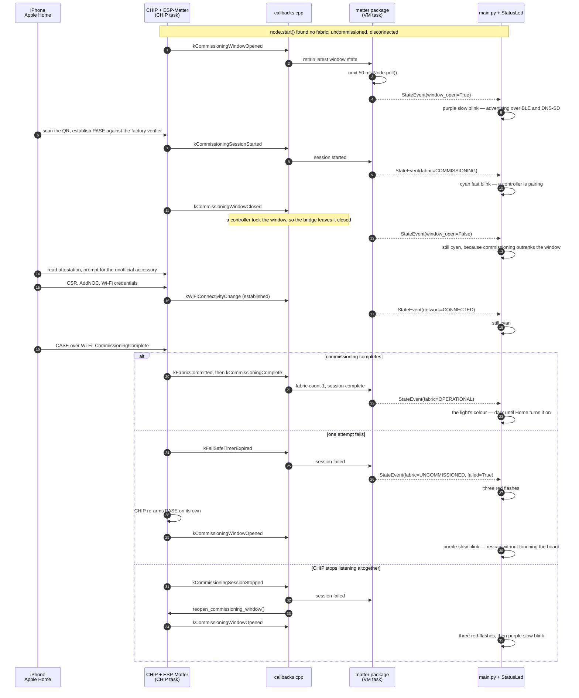

# ESP32-S3-Zero Matter Color Light

This project exposes the ESP32-S3-Zero's onboard WS2812 on GPIO21 as a Matter
Extended Color Light. ESP-Matter handles commissioning and protocol state;
`firmware/main.py` sets up the node and owns the pixel, and `firmware/color/`
turns the endpoint into a plain RGB colour, so setting the LED is one call:

```python
set_color((0, 25, 0))   # green at ten percent, on the strip and in the home
```

`main.py` is the only file in the project that imports `matter`, because that is
where the service is set up.

## What the pixel is telling you

The pixel follows the Matter device model, so you can follow pairing and the
network without a serial monitor attached. Colour names the state; blink says
whether the board is waiting (slow), working (fast), or stuck (solid):

| Pixel | Matter state |
| --- | --- |
| Dim white, solid | Firmware running, Matter not polled yet |
| Purple, slow blink | Uncommissioned, window open — scan the QR code |
| Cyan, fast blink | Commissioning — a controller is pairing |
| Red, three quick flashes | That attempt failed; purple follows |
| Amber, solid | Uncommissioned, no window — nobody can reach it |
| Amber, slow blink | Operational, Wi-Fi down — waiting for it to come back |
| The light's colour | Operational and connected; the controller owns the pixel |

Solid amber is the one that should never appear. An unpaired board is meant to
always be advertising, and `firmware-packages/matter` reopens a window whenever
the stack would otherwise stop, so solid amber means that recovery did not
work. A failure flashes rather than staying red for the same reason: if purple
does not follow, the board is stuck.

Status colours are capped at ten percent of full scale, because a status light
should not be the brightest thing in the room. Only a controller-commanded
level may reach maximum, and a controller write shows at exactly the level it
asks for.

Once paired and on Wi-Fi, the pixel shows the light's own state, so it always
agrees with Home: a light that is off in Home is dark on the board. A board
that reboots after pairing blinks amber until Wi-Fi joins, then shows the last
controller-owned colour. Opening a window for another controller blinks purple
until the window closes. [matter_status_led](../../firmware-packages/matter_status_led/README.md)
holds the full priority table.

## Build and flash

Docker is the only host dependency. From this directory, compile reusable
firmware without connecting a board:

```console
docker compose up --build --exit-code-from esp32-compile esp32-compile
```

Compose keeps the IDF/Ninja build tree and compiler cache in the named
`matter-build-cache` volume. Rebuilding the toolchain image does not discard that
volume, so a firmware-only edit recompiles only the affected sources. To force a
fully clean compile, remove the cache with `docker compose down --volumes` before
running the build again.

Compilation produces `outputs/app.esp32-s3.bin` without board credentials and
removes stale pairing artifacts. Flashing derives credentials from a key, random
unless `PASSCODE` is set, and publishes three matching files under `outputs/`:

- `app.esp32-s3.bin` is the merged firmware and factory-data image.
- `app.esp32-s3.qr.png` is the commissioning QR code for that image.
- `app.esp32-s3.setup.txt` contains the matching manual pairing code, setup
  payload, and the `passcode` key that reproduces them, so keep it secret.

Reboots keep the flashed credentials. Each flash replaces these files, so pair a
board before flashing the next.

Put the ESP32-S3-Zero in its bootloader mode and flash it with:

```console
docker compose run --rm --build esp32-flash
```

Add `--no-deps` to flash another board without recompiling. To choose a key, see
[Pairing](../../cpython-packages/matter_tools/README.md#pairing).

Set `SERIAL_PORT` when the board is not `/dev/ttyACM0`:

```console
SERIAL_PORT=/dev/ttyACM1 docker compose run --rm --build esp32-flash
```

## Watch the board

```console
docker compose run --rm --build esp32-monitor
```

Reads `$SERIAL_PORT` for `MONITOR_SECONDS` (default 90) and prints each line with
its offset from the start of the capture. A healthy boot prints
`{"event":"matter","state":"ready"}` once the stack has started and the endpoint
has been restored, then `{"event":"fabric","state":"uncommissioned"}` or
`"operational"`. Every later change of Matter state prints one line, such as
`{"event":"network","state":"connected"}`. A traceback or an
`{"event":"error"}` line is the failure.

This is the project the Matter interface is debugged against, so unlike the
others it builds with `CONFIG_LOG_DEFAULT_LEVEL_INFO=y`. CHIP decides at compile
time what it is able to say at all, and at the default `NONE` it cannot report
why a commissioning attempt failed — which is the only thing worth knowing when
Apple Home refuses to pair. Expect `[chip]` lines interleaved with the JSON;
`Commissioning failed (attempt N)` and the `CHIP_ERROR` beside it name the stage
that gave up. Drop the line from
`native/board/ESP32_S3_MATTER/sdkconfig.board` to go back to a silent build.

`MONITOR_PROBE=1` sends a newline on connect — a `>>>` prompt in the reply means
no program is running. `MONITOR_SEND='…'` types one line at the REPL, and
`MONITOR_INTERRUPT=1` sends Ctrl-C first so a running program stops and the REPL
can accept it.

## Add the light to Apple Home

1. Power or reset the flashed board and leave it running. A board that has never
   been paired blinks purple once it opens its window, and keeps blinking — the
   bridge reopens the window whenever the stack would otherwise stop advertising.
2. In Apple Home, choose **Add Accessory**.
3. Scan `outputs/app.esp32-s3.qr.png`, or enter the manual code from
   `outputs/app.esp32-s3.setup.txt`. The pixel blinks cyan fast when Home
   starts pairing.
4. Follow Apple Home's prompts to provide the 2.4 GHz Wi-Fi network and assign
   the light to a room. On success the light appears in Home switched off and
   the pixel goes dark with it — turn it on in Home to light the pixel.

Each of those steps is a CHIP event crossing into MicroPython as a change of
Matter state, and coming out as a pixel pattern. Read the diagram alongside the
pixel table above:


```mermaid
sequenceDiagram
    autonumber
    participant home as iPhone<br/>Apple Home
    participant chip as CHIP + ESP-Matter<br/>(CHIP task)
    participant cb as callbacks.cpp
    participant py as matter package<br/>(VM task)
    participant app as main.py + StatusLed

    Note over app,chip: node.start() found no fabric: uncommissioned, disconnected

    chip->>cb: kCommissioningWindowOpened
    cb->>py: retain latest window state
    py->>py: next 50 ms Node.poll()
    py-->>app: StateEvent(window_open=True)
    app->>app: purple slow blink — advertising over BLE and DNS-SD

    home->>chip: scan the QR, establish PASE against the factory verifier
    chip->>cb: kCommissioningSessionStarted
    cb->>py: session started
    py-->>app: StateEvent(fabric=COMMISSIONING)
    app->>app: cyan fast blink — a controller is pairing

    chip->>cb: kCommissioningWindowClosed
    Note over cb: a controller took the window, so the bridge leaves it closed
    py-->>app: StateEvent(window_open=False)
    app->>app: still cyan, because commissioning outranks the window

    home->>chip: read attestation, prompt for the unofficial accessory
    home->>chip: CSR, AddNOC, Wi-Fi credentials
    chip->>cb: kWiFiConnectivityChange (established)
    py-->>app: StateEvent(network=CONNECTED)
    app->>app: still cyan
    home->>chip: CASE over Wi-Fi, CommissioningComplete

    alt commissioning completes
        chip->>cb: kFabricCommitted, then kCommissioningComplete
        cb->>py: fabric count 1, session complete
        py-->>app: StateEvent(fabric=OPERATIONAL)
        app->>app: the light's colour — dark until Home turns it on
    else one attempt fails
        chip->>cb: kFailSafeTimerExpired
        cb->>py: session failed
        py-->>app: StateEvent(fabric=UNCOMMISSIONED, failed=True)
        app->>app: three red flashes
        chip->>chip: CHIP re-arms PASE on its own
        chip->>cb: kCommissioningWindowOpened
        app->>app: purple slow blink — rescan without touching the board
    else CHIP stops listening altogether
        chip->>cb: kCommissioningSessionStopped
        cb->>py: session failed
        cb->>chip: reopen_commissioning_window()
        chip->>cb: kCommissioningWindowOpened
        app->>app: three red flashes, then purple slow blink
    end
```

The two failure branches are why a failure flashes rather than staying red, and
why solid amber should never appear: whichever way an attempt ends, something
puts the board back to advertising, and the pixel follows it there. Solid amber
is the state where that did not happen.

The path is five files. `native/src/callbacks.cpp` translates CHIP's events and
owns the recovery; `matter/state.py` turns each into the next Matter state
during the 50 ms application poll; `matter_status_led` turns the state into a
pattern; `firmware/main.py` wires them together; and
`firmware/color/convert.py` gives the colour once a controller owns the light.
The [package README](../../firmware-packages/matter/README.md) diagrams the
native boundary.

Once the light is on, whichever side wrote most recently is what the pixel
shows. Both directions are plain functions in `firmware/main.py` that hand the
colour to `status.set_application()`; only `StatusLed` writes the pixel:

- A color, brightness or power change from a controller is returned by
  `Node.poll()`; `handle_events()` reads the synchronized colour from the
  endpoint once for the complete batch.
- `set_color(rgb)` shows the colour and then publishes it back, turning the
  light on. A local write shows exactly the bytes written, while the endpoint
  holds the nearest color its hue, saturation and level can represent.

While the board is pairing, unpaired, or off Wi-Fi, the Matter state outranks
both, and the light's colour returns once the board is connected again.

`main.py` runs a cooperative 50 ms Matter polling loop after boot. Interrupt it
to reach the REPL; `set_color`, `node`, `endpoint`, `status`, and `pixel` remain
in scope. The pixel stops blinking while the loop is stopped:

```console
MONITOR_INTERRUPT=1 MONITOR_SEND='set_color((0, 25, 0))' docker compose run --rm esp32-monitor
```

## Commission again

A commissioned device does not reopen its initial BLE commissioning window on
every boot. Removing the light in Apple Home drops its fabric; once the last
fabric is gone the board is uncommissioned again and blinks purple. From the
MicroPython REPL, remove an individual fabric with `node.remove_fabric(index)`
or clear all Matter state and reboot with:

```python
node.factory_reset()
```

A factory reset keeps the flashed pairing codes. If `outputs/` no longer holds
them, regenerate them from the board's key (see
[Pairing](../../cpython-packages/matter_tools/README.md#pairing)).
